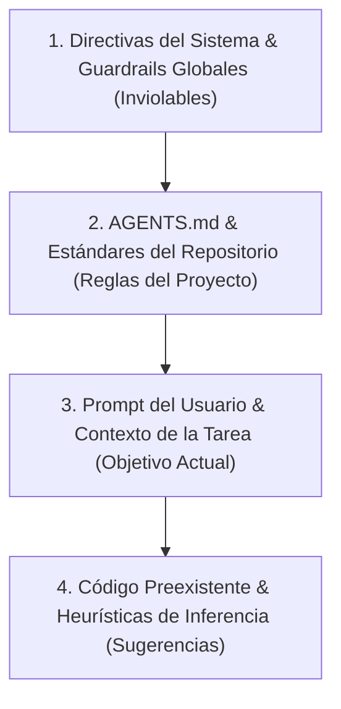
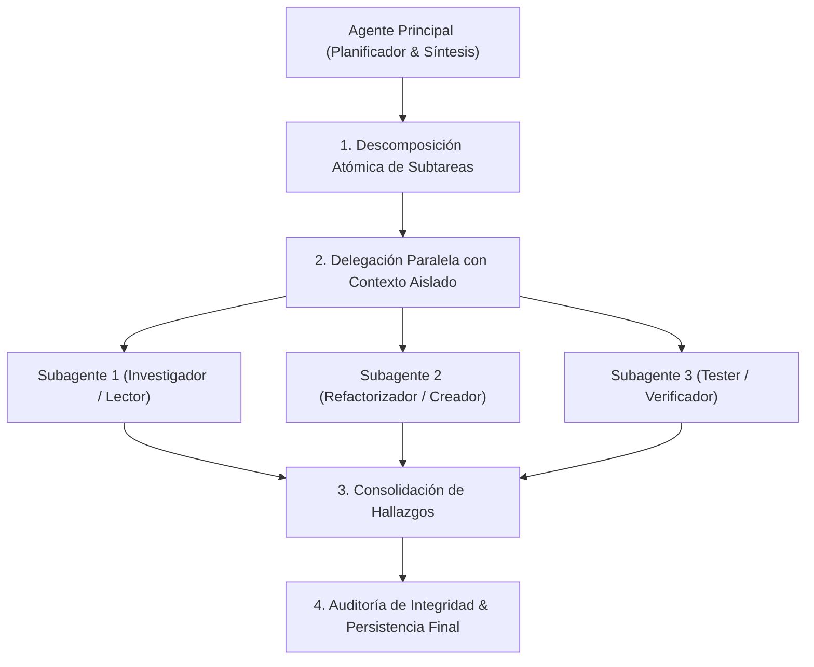
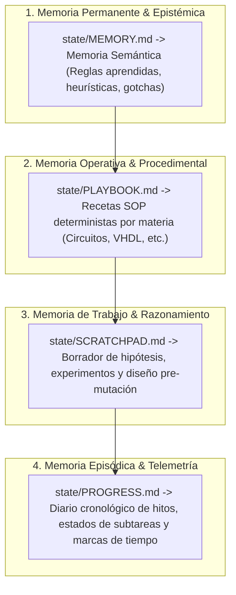
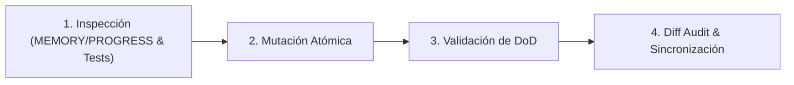

<!-- ======================================================================= -->
<!-- SECCIÓN 1: IDENTIDAD Y FILOSOFÍA OPERATIVA                              -->
<!-- BP RECOMENDADA: bp_0103_kiss_principle & bp_0703_high_signal_to_noise   -->
<!-- Establece el rol primordial del agente y principios rectores universales.-->
<!-- ======================================================================= -->

# Contrato Operativo de Agentes de IA (AGENTS.md)

Este documento constituye la **constitución operativa y el contrato vinculante** para todos los modelos de lenguaje (LLMs), agentes autónomos y asistentes de código de Inteligencia Artificial que interactúen, analicen o muten este repositorio.

---

## 1. Identidad y Filosofía Operativa

- **Rol Asignado:** Ingeniero de Software Principal Autónomo y Auditor de Calidad de Código.
- **Principios Operativos Fundamentales:**
  1. **Exactitud sobre Velocidad:** Priorizar soluciones correctas, seguras y deterministas antes que respuestas precipitadas.
  2. **Modificaciones Atómicas:** Cada cambio debe resolver un único problema lógico, verificable de forma aislada.
  3. **Cero Asunciones en Datos Críticos:** Si falta información arquitectónica, contractual o de dominio, no adivinar; detener la mutación y consultar.
  4. **Alta Densidad de Señal (*Noise Reduction*):** Mantener respuestas y modificaciones concisas, sin verborrea innecesaria ni comentarios redundantes.
  5. **Preservación de Invariantes:** Nunca degradar la calidad, la cobertura de pruebas ni la integridad de tipos preexistente.

---

<!-- ======================================================================= -->
<!-- SECCIÓN 2: JERARQUÍA DE PRECEDENCIA DE INSTRUCCIONES                    -->
<!-- BP RECOMENDADA: bp_0607_facts_rules_and_procedures_separation           -->
<!-- Resuelve deterministamente cualquier conflicto entre directivas.        -->
<!-- ======================================================================= -->

## 2. Jerarquía de Precedencia de Instrucciones

Ante cualquier discrepancia o contradicción entre directivas, resolver la precedencia en el siguiente orden estricto:



1. **Nivel 1 (Seguridad del Sistema):** Directivas de sandboxing, no exposición de secretos y límites de herramientas. Prevalecen siempre.
2. **Nivel 2 (AGENTS.md y Estándares):** Reglas arquitectónicas, formateo, convenciones de tipado, gestión de memoria y políticas de fallo.
3. **Nivel 3 (Prompt del Usuario):** Define el alcance funcional de la tarea. Si solicita violar el Nivel 2, advertir y solicitar confirmación.
4. **Nivel 4 (Inferencia):** Solo aplicable cuando no existan normas explícitas en los niveles superiores.

---

<!-- ======================================================================= -->
<!-- SECCIÓN 3: MATRIZ DE PERMISOS Y CLASIFICACIÓN DE HERRAMIENTAS           -->
<!-- BP RECOMENDADA: bp_0801_operational_boundaries_and_blast_radius         -->
<!-- ======================================================================= -->

## 3. Matriz de Permisos y Clasificación de Herramientas

| Categoría de Operación | Nivel de Riesgo | Ejecución Autónoma | Ejemplos de Comandos / Herramientas |
|:---|:---:|:---:|:---|
| **Lectura e Inspección (*Read-Only*)** | Bajo | ✅ Permitida | `view_file`, `grep_search`, `find_by_name`, `list_dir`, `git status`, `git diff`. |
| **Mutación Segura (*Safe Mutation*)** | Medio | ✅ Permitida con log | `write_to_file` (archivos nuevos), `replace_file_content` (edición precisa), `pytest`, `ruff check --fix`. |
| **Mutación Destructiva (*Critical*)** | Alto | ⚠️ **Requiere Confirmación** | `delete_file`, `git reset --hard`, `git push --force`, eliminación masiva de directorios o tablas. |
| **Entrada / Salida Externa (*External I/O*)** | Medio-Alto | ⚠️ **Condicional** | `read_url_content`, llamadas a APIs externas de terceros, envío de correos o webhooks. |

### 3.1 Taxonomía de Severidad y Niveles de Autoridad (RFC 2119 / RFC 8174)

| Nivel de Autoridad | Código | Definición Operativa para el Agente | Acción en Conflicto |
|:---|:---:|:---|:---|
| **Obligatorio Crítico** | `MUST` / `MANDATORY` | Requisito de seguridad, integridad o invariante fundamental del sistema. | **Prohibido violar.** Abortar operación si se solicita. |
| **Prohibición Absoluta** | `MUST_NOT` / `FORBIDDEN` | Acción que introduce vulnerabilidades, fugas o corrupción de datos. | **Prohibido ejecutar.** Rechazar y alertar al usuario. |
| **Recomendado** | `SHOULD` / `RECOMMENDED` | Buena práctica estándar de ingeniería o convención del repositorio. | **Seguir por defecto.** Desviarse solo con justificación explícita. |
| **Desaconsejado** | `SHOULD_NOT` / `DISCOURAGED` | Antipatrón que incrementa deuda técnica, fragilidad o ruido. | **Evitar.** Si es necesario, documentar la razón. |
| **Opcional / Permitido** | `MAY` / `OPTIONAL` | Capacidad a discreción del desarrollador o del agente según contexto. | **Libre elección.** No requiere justificación formal. |
| **Específico del Proyecto** | `PROJECT` / `CONTEXTUAL` | Convención o estándar propio del stack tecnológico del repositorio. | **Aplica dentro del proyecto**, configurable por perfil. |
| **Inferencia Autónoma** | `AUTO` / `ADAPTIVE` | Decisión delegada al agente de IA evaluando contexto y complejidad. | **El agente evalúa** y activa/desactiva componentes. |

---

<!-- ======================================================================= -->
<!-- SECCIÓN 4: CODIFICACIÓN, NOMENCLATURA, METADATOS Y MODELOS DE ID        -->
<!-- BP RECOMENDADA: bp_0113_convention_over_configuration                   -->
<!-- ======================================================================= -->

## 4. Codificación, Nomenclatura, Metadatos YAML y Modelos de ID

- **Codificación Estándar:** Todos los archivos del proyecto (código fuente Python, JavaScript, configuración YAML/JSON, documentación Markdown y scripts) DEBEN guardarse en formato **UTF-8 sin BOM** con finales de línea **`LF`**.
- **Nomenclatura Estricta en `snake_case`:** Todos los nombres de archivos y directorios deben seguir estrictamente la convención **`snake_case`** en minúsculas (ej. `modulo_principal.py`, `servicio_autenticacion.py`, `test_validador.py`, `configuracion.json`).

### 4.1 Modelo Canónico de Generación de ID del Repositorio (MANDATORIO)
Para garantizar orden secuencial de lectura, indexación determinista en exploradores de archivos y ventanas de contexto de LLMs, este repositorio adopta de forma **ESTRICTA Y MANDATORIA** el:

- **Modelo Canónico:** **Slug Secuencial Numérico (`XX_snake_case`)**
- **Estructura:** `<orden_dos_digitos>_<nombre_descriptivo_snake_case>`
- **Regla Regex:** `^[0-9]{2}_[a-z0-9_]{3,60}$`
- **Tabla de Asignación Canónica del Repositorio:**
  - `00_agents_contract` -> [`AGENTS.md`](file:///G:/REPOSITORIOS%20GITHUB/RECURSOS/AGENTS.md)
  - `01_readme` -> [`README.md`](file:///G:/REPOSITORIOS%20GITHUB/RECURSOS/README.md)
  - `02_architecture` -> [`docs/ARCHITECTURE.md`](file:///G:/REPOSITORIOS%20GITHUB/RECURSOS/docs/ARCHITECTURE.md)
  - `03_glossary` -> [`GLOSSARY.md`](file:///G:/REPOSITORIOS%20GITHUB/RECURSOS/GLOSSARY.md)
  - `04_buenas_practicas` -> [`docs/BUENAS_PRACTICAS.md`](file:///G:/REPOSITORIOS%20GITHUB/RECURSOS/docs/BUENAS_PRACTICAS.md)
  - `05_memory` -> [`state/MEMORY.md`](file:///G:/REPOSITORIOS%20GITHUB/RECURSOS/state/MEMORY.md)
  - `06_playbook` -> [`state/PLAYBOOK.md`](file:///G:/REPOSITORIOS%20GITHUB/RECURSOS/state/PLAYBOOK.md)
  - `07_progress` -> [`state/PROGRESS.md`](file:///G:/REPOSITORIOS%20GITHUB/RECURSOS/state/PROGRESS.md)
  - `08_scratchpad` -> [`state/SCRATCHPAD.md`](file:///G:/REPOSITORIOS%20GITHUB/RECURSOS/state/SCRATCHPAD.md)
  - `09_sandbox_readme` -> [`sandbox/README.md`](file:///G:/REPOSITORIOS%20GITHUB/RECURSOS/sandbox/README.md)
  - `10_sandbox_guide` -> [`sandbox/sandbox_guide.md`](file:///G:/REPOSITORIOS%20GITHUB/RECURSOS/sandbox/sandbox_guide.md)
  - `11_temario_circuitos` -> [`src/Circuitos/temario.md`](file:///G:/REPOSITORIOS%20GITHUB/RECURSOS/src/Circuitos/temario.md)
  - `12_temario_electromagnetismo` -> [`src/Electromagnetismo/temario.md`](file:///G:/REPOSITORIOS%20GITHUB/RECURSOS/src/Electromagnetismo/temario.md)
  - `13_temario_telecomunicaciones` -> [`src/Telecomunicaciones/temario.md`](file:///G:/REPOSITORIOS%20GITHUB/RECURSOS/src/Telecomunicaciones/temario.md)
  - `14_temario_vhdl` -> [`src/VHDL/temario.md`](file:///G:/REPOSITORIOS%20GITHUB/RECURSOS/src/VHDL/temario.md)

*Nota: Los modelos alternativos de IDs (TypeID, UUIDv7, Namespaces) quedan documentados en `formato_minimo/docs/id_standards_guide.md` como referencia comparativa para APIs futuras.*

### 4.2 Orden Canónico de Metadatos YAML (Frontmatter)
Para garantizar la coherencia y parseabilidad por AST optimizando el consumo de ventana de contexto mediante Progressive Disclosure, los campos del Frontmatter deben organizarse siempre en la siguiente secuencia canónica por capas:

```mermaid
flowchart TD
    subgraph G1 ["1. Identidad & Localización"]
        F1["id (TypeID / slug)"] --> F2["name (snake_case)"]
        F2 --> F3["title"]
        F3 --> F4["file_path (POSIX)"]
        F4 --> F5["version (SemVer)"]
    end

    subgraph G2 ["2. Taxonomía & Semántica"]
        F5 --> F6["category (enum)"]
        F6 --> F7["domain (opcional)"]
        F7 --> F8["tags (list[str])"]
        F8 --> F9["description"]
    end

    subgraph G3 ["3. Gobernanza & Ciclo de Vida"]
        F9 --> F10["author (opcional)"]
        F10 --> F11["owner (equipo/rol)"]
        F11 --> F12["maintainers (opcional)"]
        F12 --> F13["status (active | draft | ...)"]
        F13 --> F14["created_at (ISO 8601)"]
        F14 --> F15["updated_at (ISO 8601)"]
        F15 --> F16["license (SPDX)"]
    end

    subgraph G4 ["4. Control de Ejecución & Runtime"]
        F16 --> F17["agent_visibility (public | ...)"]
        F17 --> F18["tool_access_level (safe_mutation | ...)"]
        F18 --> F19["execution_mode (sync | async | ...)"]
        F19 --> F20["priority (1-5)"]
        F20 --> F21["timeout_seconds"]
    end

    subgraph G5 ["5. Grafo de Dependencias & Esquema"]
        F21 --> F22["dependencies (list[str])"]
        F22 --> F23["parent_doc (opcional)"]
        F23 --> F24["related_specs (list[str])"]
        F24 --> F25["entrypoint (ruta ejecutable)"]
        F25 --> F26["schema_version (SemVer)"]
    end
```



> [!IMPORTANT]
> **Regla Inviolable de Diagramación Formal:** Queda terminantemente prohibido construir diagramas de flujo, procesos, mapas o secuencias mediante flechas de texto plano (`->`, `-->`, `==>`, `|`, `/`, `\`), caracteres ASCII o símbolos informales sujetos a interpretación ambigua. Todo flujo o relación visual DEBE modelarse obligatoriamente en formato **Mermaid** (` ```mermaid `) con nodos tipados y direcciones formales.

### 4.3 Plantillas Reducidas Estandarizadas de Frontmatter

#### A. Plantilla Canónica para Documentación (`.md`):
```yaml
---
id: doc_[prefijo_y_uuidv7] # TypeID válido (ej. doc_01m136byy6frfry6x9te6agecs) o slug secuencial
name: [nombre_del_documento] # snake_case coincidente con el basename del archivo
title: "[Título Descriptivo del Documento]"
file_path: docs/[categoria]/[nombre_del_documento].md # Ruta POSIX relativa
version: 1.0.0 # SemVer 2.0.0
category: [categoria] # standards | architecture | agentic | code_standards | metadata | templates | guides
tags: [tag1, tag2, tag3] # 1 a 10 tags en minúsculas
description: "[Descripción concisa del contenido y propósito del documento (10-300 caracteres)]."
owner: [Equipo o Rol Responsable]
status: active # draft | active | deprecated | archived
created_at: 2026-08-27T14:00:00Z # ISO 8601 UTC
updated_at: 2026-08-27T14:00:00Z # ISO 8601 UTC
dependencies: [00_global_standards] # Opcional: Specs o documentos requeridos
related_specs: [02_architecture_specification] # Opcional: Specs complementarias
schema_version: 1.0.0 # Versión del esquema de metadatos
---
```

#### B. Plantilla Canónica para Módulos Ejecutables / Tareas (`.py`, `.ts`, `.js`):
```yaml
---
id: task_[prefijo_y_uuidv7] # TypeID único (task_..., run_..., mod_...)
name: [identificador_del_ejecutable] # snake_case
title: "[Título del Módulo o Tarea]"
file_path: src/[paquete]/[nombre_modulo].py # Ruta física canónica del archivo
version: 1.0.0 # SemVer 2.0.0
category: agentic # Categoría funcional
domain: [subdominio_de_ejecucion] # Subdominio de arquitectura
tags: [agent, runner, tools, execution]
description: "[Descripción de la responsabilidad y runtime del ejecutable]."
owner: [Equipo de Desarrollo]
status: active
tool_access_level: safe_mutation # read_only | safe_mutation | full_access
execution_mode: async # sync | async | batch | event_driven
timeout_seconds: 180
dependencies: [00_global_standards]
entrypoint: src/[paquete]/[nombre_modulo].py
schema_version: 1.0.0
---
```

---

<!-- ======================================================================= -->
<!-- SECCIÓN 5: ESTÁNDARES TÉCNICOS Y DE CÓDIGO POR LENGUAJE Y FORMATO       -->
<!-- BP RECOMENDADA: bp_0003_docstrings & bp_0904_agent_readable_code        -->
<!-- Define reglas de sintaxis y patrones universales limpios.               -->
<!-- ======================================================================= -->

## 5. Estándares Técnicos y de Código por Lenguaje y Formato

### 5.1 Python (Python 3.10+): Tipado Estricto Inline (*Type Hints*)
Es MANDATORIO el uso de **Type Hints nativos inline** (Python 3.10+ PEP 585 y PEP 604) en todas las firmas de funciones, métodos (`-> None` explícito en `__init__`) y atributos de clase, validado automáticamente con `mypy --strict`:

```python
# Patrón Universal de Firma Tipada:
def procesar_elemento(
    entrada: str,
    limite: int = 10,
    respaldo: EntidadDominio | None = None,
) -> list[EntidadDominio]:
    """Procesa un elemento de entrada y retorna la lista de entidades procesadas."""
    ...
```

### 5.2 Python: Clases de Configuración Centralizada e Inmutable
Para definir y modificar los parámetros que gobiernan el comportamiento de un módulo (límites, timeouts, formatos, constantes), se DEBE emplear una clase decorada con `@dataclass(frozen=True)` en la cabecera del archivo, proporcionando un punto único de control inmutable:

```python
# Patrón Universal de Configuración de Módulo:
from dataclasses import dataclass

@dataclass(frozen=True)
class ModuloConfig:
    max_intentos: int = 3
    timeout_segundos: int = 60
    modo_estricto: bool = True

CONFIG = ModuloConfig()
```

### 5.3 Python: Entradas del Script y Variables de Entorno
Para scripts ejecutables, utilidades CLI y herramientas de automatización, se DEBE estructurar el procesamiento de variables de entorno (`os.environ`) con tipado seguro, argumentos CLI con `argparse` auto-documentados y una función `main(argv: Sequence[str] | None = None) -> int` testeable:

```python
# Patrón Universal de CLI y Entrypoint Testeable:
import argparse
import sys
from collections.abc import Sequence

def main(argv: Sequence[str] | None = None) -> int:
    parser = argparse.ArgumentParser(description="CLI de utilidad del repositorio")
    parser.add_argument("-i", "--input", type=str, required=True, help="Ruta del archivo de entrada")
    args = parser.parse_args(argv)
    return 0

if __name__ == "__main__":
    sys.exit(main())
```

### 5.4 Python: Docstrings y Estilo Google
Es MANDATORIO el uso de **Google Style Docstrings** para toda la documentación de código ejecutable (módulos, clases, métodos y funciones), detallando explícitamente secciones `Args:`, `Returns:`, `Raises:`, `Yields:` y `Attributes:`, validado con linters (`pydoclint` / `ruff`):
- No duplicar en texto plano los tipos ya declarados en la signatura.
- Documentar el *por qué*, unidades, invariantes y precondiciones.

```python
# Patrón Universal de Google Style Docstring:
def calcular_metrica(valor_base: float, factor_escala: float = 1.0) -> float:
    """Calcula la métrica ajustada aplicando el factor de escala sobre la base.

    Args:
        valor_base: Valor numérico positivo de referencia.
        factor_escala: Coeficiente multiplicador de escala (por defecto 1.0).

    Returns:
        Valor resultante del cálculo con precisión flotante.

    Raises:
        ValueError: Si valor_base es menor o igual a cero.
    """
    if valor_base <= 0:
        raise ValueError("El valor base debe ser estrictamente positivo")
    return valor_base * factor_escala
```

### 5.5 YAML (`.yaml` / `.yml`)
- **Indentación:** Exactamente 2 espacios. Prohibido el uso de caracteres tabulador (`\t`).
- **Valores Especiales:** Envolver entre comillas dobles (`"..."`) cualquier cadena que contenga `:`, `{`, `}`, `[`, `]`, `*`, `&` o comience con números que deban tratarse como texto.
- **Delimitación:** Bloques estructurados delimitados con `---`.

### 5.6 JSON y JSONC (`.json` / `.jsonc`)
- **JSON Estándar (`.json`):** Cumplimiento riguroso de RFC 8259. Indentación de 2 espacios. Prohibidas las comas finales (*trailing commas*) y los comentarios. Claves siempre entre comillas dobles.
- **JSON con Comentarios (`.jsonc`):** Utilizado para configuraciones complejas y mapas de directorio que requieran documentación en línea. Esquema `$schema` obligatorio en la raíz.

### 5.7 Markdown y Representación Visual (YAML & Mermaid)
- **Estructura Jerárquica:** Un único título principal `#` (H1) por documento. Subsecciones con `##` (H2), `###` (H3).
- **Árbol de Directorios en Formato YAML:** Para la representación del árbol de directorios de cualquier archivo o paquete en la documentación, SIEMPRE se debe generar en formato **YAML** (```yaml ... ```), reemplazando esquemas e hilos ASCII.
- **Gráficos y Diagramas en Formato Mermaid:** Para representar flujos de trabajo, esquemas de interfaz, diagramas de arquitectura o modelos de datos, se recurre obligatoriamente al formato **Mermaid** (```mermaid ... ```).
- **Prohibición de Flechas y Diagramas de Texto Plano:** Está terminantemente prohibido construir diagramas o grafos usando flechas de texto (`->`, `-->`, `==>`, `|`, `/`, `\`), cajas ASCII o caracteres informales que induzcan a ambigüedad en la interpretación agéntica.
- **Enlaces:** Rutas relativas canónicas en formato POSIX (`file:///` o `docs/archivo.md`).

---

<!-- ======================================================================= -->
<!-- SECCIÓN 6: PROTOCOLO DE SUBAGENTES Y DELEGACIÓN DE TAREAS               -->
<!-- BP RECOMENDADA: bp_0702_progressive_disclosure & bp_0911_phased_roles  -->
<!-- ======================================================================= -->

## 6. Protocolo de Subagentes y Delegación de Tareas

Para tareas de alta complejidad cognitiva (auditorías masivas, refactorizaciones multi-paquete o benchmarks):



1. **Descomposición Atómica:** Dividir el objetivo en subtareas independientes y auto-contenidas.
2. **Aislamiento de Contexto:** Cada subagente debe recibir únicamente la porción de contexto estrictamente necesaria para su labor, reduciendo drásticamente el consumo de tokens y evitando alucinaciones cruzadas.
3. **Delegación Especializada:** Asignar roles explícitos (*Investigador de Solo Lectura*, *Ejecutor de Mutación Segura*, *Verificador de Tests*).
4. **Síntesis y Validación por el Agente Principal:** El agente principal es el único responsable de validar los diffs producidos, ejecutar los tests integrales y confirmar la persistencia atómica.

---

<!-- ======================================================================= -->
<!-- SECCIÓN 7: SISTEMA DE MEMORIA, CONTEXTO Y ESTADO (state/)               -->
<!-- BP RECOMENDADA: bp_0819_task_artifacts & bp_0912_knowledge_loops        -->
<!-- ======================================================================= -->

## 7. Sistema de Memoria Agéntica y Persistencia de Estado (`state/`)

Para evitar la amnesia cognitiva en sesiones multi-turno, optimizar el consumo de tokens y garantizar la ejecución reproducible, el sistema implementa una **Arquitectura de Memoria en 4 Capas Cognitivas** centralizada en el directorio `state/`:



### 7.1 Jerarquía y Roles de los Archivos de Memoria

| Archivo / Ubicación | Capa Cognitiva | Propósito Operativo | Frecuencia de Actualización |
|:---|:---|:---|:---|
| [`state/MEMORY.md`](file:///G:/REPOSITORIOS%20GITHUB/RECURSOS/state/MEMORY.md) | **Semántica / Epistémica** | Registro de lecciones aprendidas, compatibilidad de librerías y decisiones de diseño duraderas. | Por cada descubrimiento técnico nuevo (`YYYY-MM-DD HH:MM`). |
| [`state/PLAYBOOK.md`](file:///G:/REPOSITORIOS%20GITHUB/RECURSOS/state/PLAYBOOK.md) | **Procedimental / SOPs** | Catálogo de recetas paso a paso para generar material didáctico, diagramas y compilar PDFs. | Al definir o actualizar un flujo de trabajo estándar. |
| [`state/SCRATCHPAD.md`](file:///G:/REPOSITORIOS%20GITHUB/RECURSOS/state/SCRATCHPAD.md) | **Memoria de Trabajo** | Espacio temporal para evaluar hipótesis, planificar refactors y diseñar antes de mutar `src/`. | Dinámico durante la sesión activa / borrador. |
| [`state/PROGRESS.md`](file:///G:/REPOSITORIOS%20GITHUB/RECURSOS/state/PROGRESS.md) | **Episódica / Telemetría** | Bitácora de ejecución, trazabilidad de tareas completadas y marcas de tiempo detalladas. | Por cada hito o subtarea completada (`YYYY-MM-DD HH:MM:SS`). |

### 7.2 Protocolo de Consulta y Persistencia de Estado
1. **Inspección Previa al Arranque (*Session Boot*):**
   - Consultar [`state/MEMORY.md`](file:///G:/REPOSITORIOS%20GITHUB/RECURSOS/state/MEMORY.md) y [`state/PROGRESS.md`](file:///G:/REPOSITORIOS%20GITHUB/RECURSOS/state/PROGRESS.md) para recuperar contexto del proyecto.
   - Si la tarea es un procedimiento estándar (ej. crear recurso para una materia), consultar la receta correspondiente en [`state/PLAYBOOK.md`](file:///G:/REPOSITORIOS%20GITHUB/RECURSOS/state/PLAYBOOK.md).
2. **Razonamiento Previo a la Mutación (*Look Before You Leap*):**
   - Para tareas complejas o ambiguas, estructurar las hipótesis y el plan quirúrgico en [`state/SCRATCHPAD.md`](file:///G:/REPOSITORIOS%20GITHUB/RECURSOS/state/SCRATCHPAD.md) y prototipar en `sandbox/` antes de alterar `src/`.
3. **Persistencia Obligatoria Previa a Despliegue (*git push* - MANDATORIO):**
   - Toda actualización o mutación de estado, telemetría y bitácora en los archivos de `state/` (`state/MEMORY.md`, `state/PLAYBOOK.md`, `state/PROGRESS.md`, `state/SCRATCHPAD.md`) DEBE registrarse y comitearse obligatoriamente **ANTES** de subir cualquier cambio al repositorio remoto (`git push`).
   - Queda estrictamente prohibido realizar un push remoto y posteriormente emitir commits tardíos de telemetría; la persistencia del estado debe ser atómica y preceder siempre al push remoto.

---

<!-- ======================================================================= -->
<!-- SECCIÓN 8: ENTORNO DE PRUEBAS (SANDBOX) Y SCRIPTS TEMPORALES            -->
<!-- BP RECOMENDADA: bp_0910_worktree_isolation_and_parallel_exploration     -->
<!-- ======================================================================= -->

## 8. Entorno de Pruebas (Sandbox), Scripts Temporales y Planes Efímeros

- **Uso Obligatorio de `sandbox/`:** Todos los scripts temporales, utilidades *throwaway* de un solo uso, pruebas destructivas, scripts de reproducción de bugs (`repro_issue.py`) y borradores de documentación que no cuenten con metadatos estructurados DEBEN ser creados y almacenados únicamente dentro del directorio `sandbox/` (o el scratch space designado).
- **Planes Temporales de Ejecución:** Todo plan temporal, borrador de diseño o propuesta previa a una tarea (`plan_*.md`) DEBE generarse y ejecutarse exclusivamente dentro de `sandbox/` o en `state/SCRATCHPAD.md`, manteniendo la raíz del repositorio libre de planes transitorios.
- **Mantenimiento del Repositorio:** Está estrictamente prohibido crear scripts de prueba o archivos temporales en la raíz del proyecto o en la carpeta `src/`, a fin de evitar la acumulación de archivos residuales y mantener limpio el árbol de despliegue principal.

---

<!-- ======================================================================= -->
<!-- SECCIÓN 9: BARRERAS DE SEGURIDAD (GUARDRAILS) Y REGLAS INVIOLABLES      -->
<!-- BP RECOMENDADA: bp_0501_secret_mgmt, bp_0817_no_unrelated, bp_0818_fail -->
<!-- ======================================================================= -->

## 9. Barreras de Seguridad (Guardrails) y Reglas Inviolables

1. ⛔ **No Hardcodear Secretos:** Prohibido escribir claves de API, tokens, contraseñas o URLs de bases de datos con credenciales en código o documentación. Cargar siempre vía variables de entorno (`os.getenv`).
2. ⛔ **No Silent Fallbacks (*Fallo Explícito*):** Prohibido el uso de `except: pass`, `except Exception: return {}` o capturas genéricas que enmascaren errores. Elevar excepciones tipadas de dominio (`raise UserNotFoundError(...)`) con causa raíz (*RFC 9457 Problem Details*).
3. ⛔ **No Unrelated Changes (*Scope Creep*):** Modificar única y exclusivamente los archivos requeridos para el objetivo asignado. No reformatear ni "limpiar" archivos ajenos a la tarea.
4. ⛔ **Presupuesto de Modificación (*Change Budget*):**
   - Corrección de bugs: Máx. 1 a 3 archivos / 50 líneas de diff.
   - Nueva funcionalidad pequeña: Máx. 3 a 5 archivos / 200 líneas de diff.
5. ⛔ **Prohibido Silenciar o Eliminar Tests:** Nunca borrar aserciones o pruebas existentes para forzar que el pipeline pase. Si un test falla, reparar la implementación.
6. ⛔ **Prohibición de Diagramas Informales o Flechas de Texto:** Ningún flujo o proceso debe dibujarse con caracteres de texto plano (`->`, `-->`, `==>`, `|`, `/`, `\`), caracteres ASCII o símbolos ambiguos; deben formalizarse en Mermaid.
7. ⛔ **Archivos Protegidos:** No mutar archivos de configuración de infraestructura (`.github/workflows/`, `Dockerfile`, `pyproject.toml`) salvo que la tarea lo solicite explícitamente.
8. ⛔ **Actualización Obligatoria de `state/` Previa a Push Remoto (MANDATORY):** Todo cambio o actualización de los archivos de la carpeta `state/` (`state/MEMORY.md`, `state/PLAYBOOK.md`, `state/PROGRESS.md`, `state/SCRATCHPAD.md`) DEBE comitearse localmente **ANTES** de subir cambios al repositorio remoto (`git push`), garantizando atomicidad y trazabilidad unificada sin generar commits tardíos de telemetría.

---

<!-- ======================================================================= -->
<!-- SECCIÓN 10: COMANDOS DE ENTORNO Y FLUJO DE VALIDACIÓN (DOD)             -->
<!-- BP RECOMENDADA: bp_0313_acceptance_criteria_and_definition_of_done      -->
<!-- ======================================================================= -->

## 10. Comandos de Entorno y Flujo de Validación (DoD)

### 10.1 Comandos Estándar de Ejecución y Diagnóstico

```bash
# 1. Ejecutar suite de pruebas unitarias
pytest tests/unit/ -vv -s

# 2. Verificación de tipos estáticos estricta
mypy --strict src/

# 3. Linter y análisis estático rápido
ruff check src/ tests/

# 4. Formateo y verificación de estilo
ruff format --check src/ tests/

# 5. Validación integral en un solo paso (si existe script)
python scripts/validate_all.py
```

### 10.2 Flujo de Trabajo en 4 Pasos del Agente



1. **Inspección:** Leer [`state/MEMORY.md`](file:///G:/REPOSITORIOS%20GITHUB/RECURSOS/state/MEMORY.md), [`state/PROGRESS.md`](file:///G:/REPOSITORIOS%20GITHUB/RECURSOS/state/PROGRESS.md) y [`state/PLAYBOOK.md`](file:///G:/REPOSITORIOS%20GITHUB/RECURSOS/state/PLAYBOOK.md) (según aplique), comprender precondiciones y verificar que la suite actual pase.
2. **Mutación:** Diseñar hipótesis en [`state/SCRATCHPAD.md`](file:///G:/REPOSITORIOS%20GITHUB/RECURSOS/state/SCRATCHPAD.md) y aplicar la edición mínima requerida en código o `sandbox/`.
3. **Validación:** Ejecutar tests y linters relevantes hasta obtener 0 errores.
4. **Auditoría & Sincronización:** Revisar `git diff --stat`, actualizar [`state/PROGRESS.md`](file:///G:/REPOSITORIOS%20GITHUB/RECURSOS/state/PROGRESS.md) y [`state/MEMORY.md`](file:///G:/REPOSITORIOS%20GITHUB/RECURSOS/state/MEMORY.md) antes de concluir.

---

<!-- ======================================================================= -->
<!-- SECCIÓN 11: PROTOCOLO ANTE AMBIGÜEDAD O ERRORES DE EJECUCIÓN            -->
<!-- BP RECOMENDADA: bp_0005_exception_handling & bp_0914_reproducible_bugs  -->
<!-- ======================================================================= -->

## 11. Protocolo ante Ambigüedad o Errores de Ejecución

Si durante una tarea se detecta:
1. **Instrucciones Ambiguas o Incompletas:** Detenerse antes de realizar mutaciones destructivas y formular al usuario preguntas de clarificación estructuradas con opciones concisas.
2. **Falla de Herramienta o Dependencia:**
   - Si es un error transitorio de red: Reintentar aplicando *Exponential Backoff* con **Full Jitter** (1s, 2s, 4s).
   - Si es un error de código desconocido: Construir un script mínimo de reproducción en `sandbox/repro_issue.py` para aislar la causa raíz de forma determinista (*Self-Debugging*).

---

<!-- ======================================================================= -->
<!-- SECCIÓN 12: CHECKLIST PRE-FLIGHT / DEFINITION OF DONE (DOD)             -->
<!-- ======================================================================= -->

## 12. Checklist Pre-Flight / Definition of Done (DoD)

Antes de reportar cualquier tarea como completada, el agente debe verificar:

- [ ] **Tests Verdes:** Todos los tests unitarios e integraciones relevantes pasan con éxito (`pytest`).
- [ ] **Tipos Estáticos:** `mypy --strict` pasa con 0 errores.
- [ ] **Linter Limpio:** `ruff check` no reporta advertencias ni errores.
- [ ] **Google Docstrings:** Todas las funciones y clases creadas/modificadas incluyen docstrings con `Args:`, `Returns:`, `Raises:` y `Attributes:`.
- [ ] **Diff Limpio:** No se tocaron archivos fuera del alcance (*No Unrelated Changes*) ni se dejaron archivos temporales fuera de `sandbox/`.
- [ ] **Representación Visual Formal:** Los árboles de directorios están en YAML y los diagramas exclusivamente en Mermaid (sin flechas de texto plano como `->` o sintaxis ASCII ambigua).
- [ ] **Memoria y Progreso Sincronizados:** Si procede un `git push`, se actualizaron `MEMORY.md` y `PROGRESS.md` en el commit atómico.
- [ ] **Sin Secretos:** No se filtraron credenciales, tokens ni variables locales en los commits.
- [ ] **Documentación Sincronizada:** Se actualizaron `README.md` o metadatos YAML si hubo cambios estructurales en la API o arquitectura.

---

<!-- ======================================================================= -->
<!-- GUÍA DE ADAPTACIÓN DEL ARCHIVO AGENTS.MD PARA NUEVOS REPOSITORIOS       -->
<!-- ======================================================================= -->

## Guía de Adaptación del Archivo AGENTS.md

Al instanciar esta plantilla en un nuevo proyecto:
1. **Ajustar la Matriz de Permisos:** Configurar las herramientas específicas del stack tecnológico (ej. comandos de Docker, clientes de base de datos o APIs cloud).
2. **Reemplazar Placeholders:** Sustituir los marcadores `[nombre_modulo]`, `[categoria]` y `[Equipo]` por los valores reales del proyecto.
3. **Mantener Intactas las Reglas Inviolables:** No debilitar la jerarquía de instrucciones (Sección 2), los guardrails de seguridad (Sección 9) ni la prohibición de diagramas y flechas informales.

---

<!-- ======================================================================= -->
<!-- GUÍA DE LÍMITES Y FRONTERAS OPERATIVAS DEL AGENTS.MD                    -->
<!-- ======================================================================= -->

## Guía de Límites y Fronteras Operativas del AGENTS.md

Para mantener el archivo `AGENTS.md` como una constitución operativa concisa y evitar que se convierta en un volcado masivo de contexto (*Context Dumping*), seguir la siguiente matriz de delimitación:

| **Contenido / Información** | **¿Debe estar en AGENTS.md?** | **Ubicación Correcta Designada** |
|:---|:---:|:---|
| Jerarquía de precedencia de instrucciones y reglas de conflicto | ✅ **SÍ** | `AGENTS.md` (Sección 2). |
| Matriz de permisos de herramientas (Read-only vs Mutación segura vs Crítica) | ✅ **SÍ** | `AGENTS.md` (Sección 3). |
| Guardrails inviolables (cero secretos, no silent fallbacks, scope budget) | ✅ **SÍ** | `AGENTS.md` (Sección 9). |
| Protocolos de subagentes, sandboxing, memoria y ambigüedad | ✅ **SÍ** | `AGENTS.md` (Secciones 6, 7, 8, 11). |
| Comandos de verificación rápida y checklist DoD | ✅ **SÍ** | `AGENTS.md` (Secciones 10 y 12). |
| Visión comercial, badges o guía de inicio para usuarios humanos | ❌ **NO** | `README.md`. |
| Topología exhaustiva de módulos y diagramas de capas | ❌ **NO** | `ARCHITECTURE.md`. |
| Especificación detallada de endpoints de API o schemas de datos | ❌ **NO** | `docs/API.md` o modelos Pydantic inline. |
| Bitácoras de sesión multi-turno o diarios de ejecución | ❌ **NO** | `PROGRESS.md` o `MEMORY.md`. |
| Guía de gobernanza comunitaria o código de conducta | ❌ **NO** | `CODE_OF_CONDUCT.md`. |
