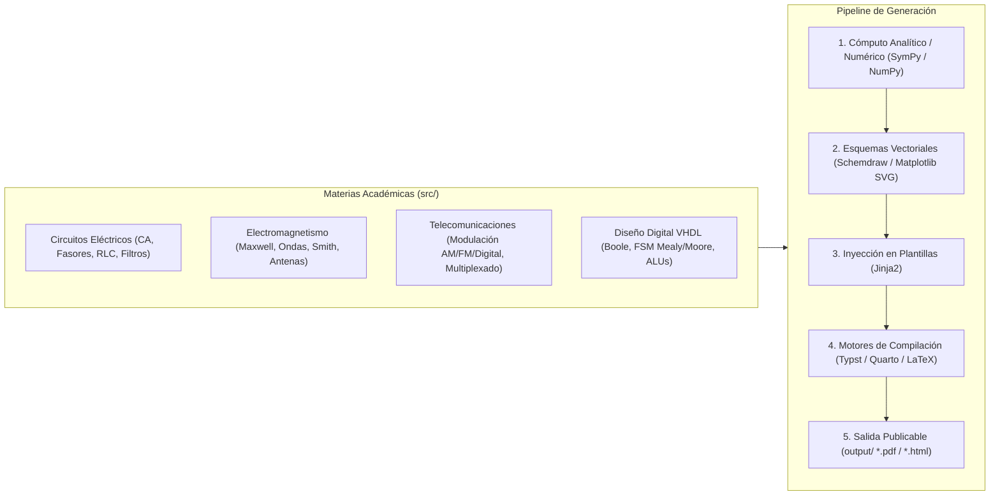

# Sistema de Generación de Recursos Didácticos Multidisciplinares

> Plataforma unificada y desacoplada para el cálculo analítico y numérico, diagramación técnica vectorial y compilación automatizada de material docente de ingeniería (guías de estudio, problemarios, exámenes y presentaciones) mediante **Python 3.14**, **Typst**, **Quarto** y **LaTeX**.

---

## 1. Propósito y Alcance

Este repositorio proporciona la infraestructura de software y directrices de ingeniería para crear recursos didácticos reproducibles, rigurosos y tipográficamente de alta calidad para cuatro materias fundamentales de ingeniería:



---

## 2. Estructura Base del Repositorio

La arquitectura del repositorio sigue una organización modular en capas con separación estricta entre código de producción, estado agéntico, validación y espacio de experimentación:

```yaml
recursos_didacticos_sistema:
  .editorconfig: "Configuración global de formato, indentación y finales de línea LF"
  .gitignore: "Exclusiones exhaustivas para Python, Jupyter, Quarto, LaTeX y temporales"
  pyproject.toml: "Especificación PEP 621 unificada de dependencias, linters y tests"
  AGENTS.md: "Contrato operativo y guardrails para agentes autónomos (00_agents_contract)"
  README.md: "Visión general, estructura base e inicio rápido (01_readme)"
  GLOSSARY.md: "Glosario ontológico y lenguaje ubicuo del dominio (03_glossary)"
  docs/:
    ARCHITECTURE.md: "Topología modular en 4 capas y pipeline de exportación (02_architecture)"
    BUENAS_PRACTICAS.md: "Directrices de ingeniería, cómputo científico y DoD (04_buenas_practicas)"
  schemas/:
    frontmatter.schema.json: "Esquema JSON Draft 2020-12 para metadatos Markdown"
    manifest.schema.json: "Esquema para composición modular, perfiles y compiladores"
    memory_entry.schema.json: "Esquema para heurísticas y memoria semántica"
    rules.schema.json: "Esquema para reglas RFC 2119 / RFC 8174 de AGENTS.md"
  src/:
    Circuitos/:
      temario.md: "Temario curricular oficial de Circuitos (11_temario_circuitos)"
    Electromagnetismo/:
      temario.md: "Temario curricular oficial de Electromagnetismo (12_temario_electromagnetismo)"
    Telecomunicaciones/:
      temario.md: "Temario curricular oficial de Telecomunicaciones (13_temario_telecomunicaciones)"
    VHDL/:
      temario.md: "Temario curricular oficial de VHDL (14_temario_vhdl)"
  state/:
    MEMORY.md: "Memoria semántica permanente de runtime y lecciones aprendidas (05_memory)"
    PLAYBOOK.md: "Procedimientos operativos estandarizados y recetas SOPs (06_playbook)"
    PROGRESS.md: "Diario cronológico y telemetría de hitos completados (07_progress)"
    SCRATCHPAD.md: "Memoria de trabajo para formulación de hipótesis técnicas (08_scratchpad)"
  sandbox/:
    README.md: "Entorno de pruebas aisladas y Blast Radius (09_sandbox_readme)"
    sandbox_guide.md: "Guía técnica y ciclo de promoción en 5 pasos (10_sandbox_guide)"
    .gitignore: "Ignora prototipos efímeros proto_*.py"
  tests/:
    __init__.py: "Inicializador del paquete de pruebas"
    validate_metadata.py: "Validador CLI determinista de YAML frontmatter"
    test_validate_metadata.py: "Suite de pruebas unitarias con Pytest (6/6 tests passing)"
  output/:
    .gitkeep: "Directorio de destino para PDFs y esquemas generados (ignorado en Git)"
```

---

## 3. Inicio Rápido (Quickstart)

### 3.1 Requisitos del Sistema
- **Python:** 3.10+ (verificado y optimizado en Python 3.14.6 AMD64).
- **Compiladores Locales:**
  - [Typst CLI](https://typst.app/) (`v0.15.1` o superior).
  - [Quarto CLI](https://quarto.org/) (`v1.9.38` o superior).
  - Distribución LaTeX (MiKTeX `x64` con `pdflatex`).

### 3.2 Configuración del Entorno Virtual
```powershell
# 1. Crear el entorno virtual con Python de la máquina
python -m venv .venv

# 2. Activar el entorno virtual (PowerShell en Windows)
.\.venv\Scripts\Activate.ps1

# 3. Instalar las dependencias centralizadas
pip install -e .
```

### 3.3 Registro del Kernel de Jupyter para Quarto
Para permitir la ejecución de celdas de cálculo en Quarto dentro del entorno virtual:
```powershell
python -m ipykernel install --user --name recursos-didacticos --display-name "Python (.venv Recursos)"
```

### 3.4 Verificación y Ejecución de Pruebas
```powershell
# Ejecutar la suite de pruebas unitarias
pytest tests/ -v

# Validar integridad de metadatos en todos los Markdown del repositorio
python tests/validate_metadata.py

# Verificación de tipos estáticos con Mypy estricto
mypy --strict tests/

# Análisis estático y formateo con Ruff
ruff check .
```

---

## 4. Mapa de Navegación Documental (Progressive Disclosure)

Todos los documentos del repositorio siguen el estándar obligatorio de **Slug Secuencial Numérico (`XX_snake_case`)**:

| ID | Documento | Rol y Propósito | Nivel |
|:---:|:---|:---|:---:|
| `00` | **[`AGENTS.md`](file:///G:/REPOSITORIOS%20GITHUB/RECURSOS/AGENTS.md)** | Constitución operativa, guardrails y directivas de ejecución para agentes. | Contractual |
| `01` | **[`README.md`](file:///G:/REPOSITORIOS%20GITHUB/RECURSOS/README.md)** | Onboarding, arquitectura general y guía de inicio rápido. | General |
| `02` | **[`docs/ARCHITECTURE.md`](file:///G:/REPOSITORIOS%20GITHUB/RECURSOS/docs/ARCHITECTURE.md)** | Especificación arquitectónica modular en 4 capas y pipeline pedagógico. | Arquitectura |
| `03` | **[`GLOSSARY.md`](file:///G:/REPOSITORIOS%20GITHUB/RECURSOS/GLOSSARY.md)** | Glosario ontológico, lenguaje ubicuo e invariantes de dominio. | Semántico |
| `04` | **[`docs/BUENAS_PRACTICAS.md`](file:///G:/REPOSITORIOS%20GITHUB/RECURSOS/docs/BUENAS_PRACTICAS.md)** | Principios universales (KISS, YAGNI, DRY) y buenas prácticas científicas. | Estándares |
| `05` | **[`state/MEMORY.md`](file:///G:/REPOSITORIOS%20GITHUB/RECURSOS/state/MEMORY.md)** | Memoria semántica persistente con lecciones aprendidas y gotchas de runtime. | Epistémico |
| `06` | **[`state/PLAYBOOK.md`](file:///G:/REPOSITORIOS%20GITHUB/RECURSOS/state/PLAYBOOK.md)** | Procedimientos Operativos Estandarizados (SOPs) para generar recursos. | Procedimental |
| `07` | **[`state/PROGRESS.md`](file:///G:/REPOSITORIOS%20GITHUB/RECURSOS/state/PROGRESS.md)** | Bitácora cronológica y telemetría de hitos de desarrollo. | Episódico |
| `08` | **[`state/SCRATCHPAD.md`](file:///G:/REPOSITORIOS%20GITHUB/RECURSOS/state/SCRATCHPAD.md)** | Memoria de trabajo para diseño y formulación de hipótesis pre-mutación. | Trabajo |
| `09` | **[`sandbox/README.md`](file:///G:/REPOSITORIOS%20GITHUB/RECURSOS/sandbox/README.md)** | Espacio efímero para experimentación aislada y planes temporales. | Aislamiento |
| `10` | **[`sandbox/sandbox_guide.md`](file:///G:/REPOSITORIOS%20GITHUB/RECURSOS/sandbox/sandbox_guide.md)** | Guía técnica de blast radius y ciclo de promoción en 5 pasos hacia `src/`. | Protocolo |
| `11` | **[`src/Circuitos/temario.md`](file:///G:/REPOSITORIOS%20GITHUB/RECURSOS/src/Circuitos/temario.md)** | Temario oficial curricular de Circuitos Eléctricos en CA. | Curricular |
| `12` | **[`src/Electromagnetismo/temario.md`](file:///G:/REPOSITORIOS%20GITHUB/RECURSOS/src/Electromagnetismo/temario.md)** | Temario oficial curricular de Teoría Electromagnética. | Curricular |
| `13` | **[`src/Telecomunicaciones/temario.md`](file:///G:/REPOSITORIOS%20GITHUB/RECURSOS/src/Telecomunicaciones/temario.md)** | Temario oficial curricular de Sistemas de Telecomunicaciones. | Curricular |
| `14` | **[`src/VHDL/temario.md`](file:///G:/REPOSITORIOS%20GITHUB/RECURSOS/src/VHDL/temario.md)** | Temario oficial curricular de Diseño Digital y VHDL. | Curricular |

---

## 5. Estándares de Contribución y Calidad

1. **Cumplimiento del Contrato Agéntico:** Todo asistente de IA o colaborador debe seguir estrictamente los guardrails definidos en [`AGENTS.md`](file:///G:/REPOSITORIOS%20GITHUB/RECURSOS/AGENTS.md).
2. **Validación de Metadatos:** Cualquier nuevo documento Markdown debe poseer Frontmatter estructurado verificable con [`tests/validate_metadata.py`](file:///G:/REPOSITORIOS%20GITHUB/RECURSOS/tests/validate_metadata.py).
3. **Invariante Vectorial:** Todo diagrama técnico exportado a `output/` debe generarse en formato vectorial (`.svg` o `.pdf`) para garantizar nitidez tipográfica en impresión.
4. **Commits Atómicos y Claros:** Modificaciones atómicas, con pruebas unitarias asociadas y sin advertencias de linters.
