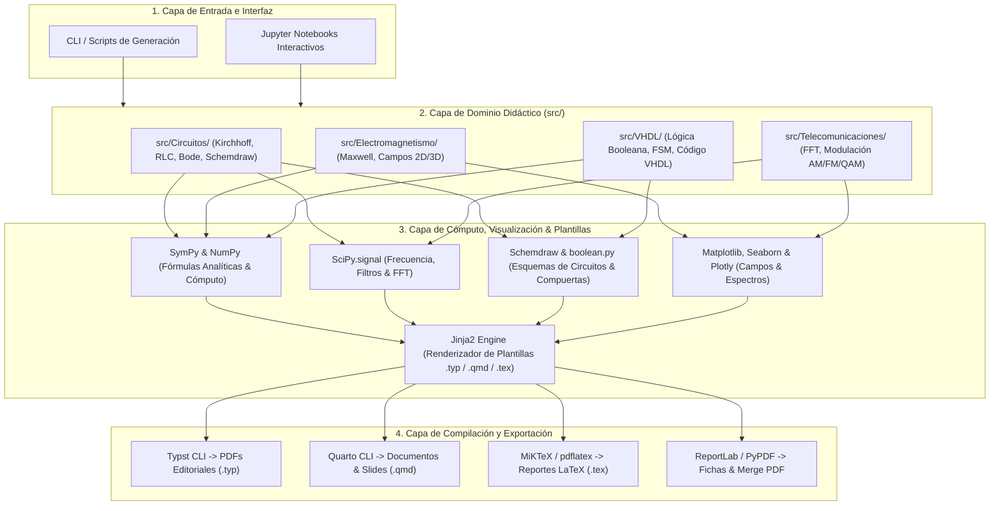
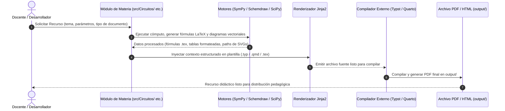

# Arquitectura del Sistema de Recursos Didácticos (ARCHITECTURE.md)

Este documento define la **topología modular, fronteras de dominio, flujo de transformación y estándares de exportación** del sistema de generación de recursos didácticos para **Circuitos**, **Electromagnetismo**, **Telecomunicaciones** y **VHDL**.

---

## 1. Visión y Principios de Diseño

El sistema transforma conceptos de ingeniería eléctrica, electrónica y telecomunicaciones en documentos pedagógicos de alta calidad visual y editorial (PDF, HTML y diapositivas), operando bajo los siguientes principios:

1. **Modularidad por Disciplina Técnica:** Cada materia (`Circuitos`, `Electromagnetismo`, `Telecomunicaciones`, `VHDL`) reside en su propio módulo en `src/` con utilidades de cómputo, esquemas y visualización específicos.
2. **Separación entre Cómputo y Presentación:** El cálculo analítico/numérico y la síntesis esquemática se desacoplan por completo de la sintaxis del documento final (Typst, Quarto o LaTeX).
3. **Salida Vectorial de Alta Definición:** Todos los diagramas de circuitos, líneas de campo, espectros de frecuencia y esquemas lógicos se generan en formatos vectoriales (`.svg`, `.pdf`) para garantizar nitidez tipográfica en impresión y pantalla.
4. **Determinismo y Reproducibilidad:** Las mismas funciones y parámetros de entrada producen idénticos recursos didácticos sin efectos colaterales.

---

## 2. Topología del Sistema y Capas Arquitectónicas

El sistema adopta una **Arquitectura en Capas de Pipeline Modular (*Modular Pipeline Architecture*)** estructurada en cuatro niveles bien definidos:

---

## 3. Delimitación de Módulos y Responsabilidades

| **Capa / Módulo** | **Ruta en Repositorio** | **Responsabilidad Principal** | **Librerías / Tecnologías Clave** |
|:---|:---|:---|:---|
| **Configuración Core** | `src/core/` | Parámetros globales inmutables, rutas de salida y utilidades de renderizado. | `@dataclass(frozen=True)`, `pathlib` |
| **Memoria y Estado** | `state/` | Persistencia agéntica (Semántica, Procedimental/SOPs, Trabajo, Episódica). | `MEMORY.md`, `PLAYBOOK.md`, `PROGRESS.md`, `SCRATCHPAD.md` |
| **Circuitos** | `src/Circuitos/` | Análisis CD/CA, transitorios RLC, diagramas de Bode y generación de esquemas circuitales. | `schemdraw`, `sympy`, `scipy.signal`, `pint` |
| **Electromagnetismo** | `src/Electromagnetismo/` | Ecuaciones de Maxwell, operadores diferenciales vectoriales, líneas de campo y superficies 3D. | `sympy.vector`, `numpy`, `matplotlib`, `plotly` |
| **Telecomunicaciones** | `src/Telecomunicaciones/` | Análisis espectral (FFT), modulaciones analógicas/digitales (AM, FM, QAM, PSK) y diagramas de constelación. | `scipy.signal`, `numpy`, `matplotlib`, `plotly` |
| **VHDL** | `src/VHDL/` | Álgebra booleana, tablas de verdad, diagramas de compuertas lógicas, síntesis de FSM y emisión de código VHDL. | `sympy.logic`, `boolean.py`, `schemdraw.logic`, `jinja2` |
| **Plantillas** | `templates/` (`typst/`, `quarto/`, `latex/`) | Diseños base parametrizados para exámenes, guías de estudio, formularios y diapositivas. | `jinja2`, `.typ`, `.qmd`, `.tex` |
| **Exportador** | `src/core/exporter.py` | Invocación de compiladores locales (`typst`, `quarto`, `pdflatex`) y gestión de salida. | `subprocess`, `pypdf`, `reportlab` |
| **Salida (Artefactos)** | `output/` | Destino final de los recursos generados (`.pdf`, `.svg`, `.html`). | *Ignorado en Git* |

---

## 4. Flujo de Secuencia: Generación de un Recurso Didáctico

El siguiente diagrama detalla el flujo secuencial estándar para la creación y compilación de una guía o examen didáctico:

---

## 5. Invariantes Arquitectónicos y Reglas de Calidad

1. **Pureza Funcional en Cálculos:** Las funciones de cálculo analítico, procesamiento de señales y lógica digital deben ser puras (mismos argumentos retornan el mismo resultado) y no realizar llamadas directas al sistema de archivos.
2. **Tipado Estricto (Python 3.10+ PEP 585 & PEP 604):** Todos los módulos en `src/` deben incluir anotaciones de tipo nativas inline y validar con `mypy --strict`.
3. **Gestión Centralizada de Salidas:** Ningún script debe escribir archivos temporales o finales fuera del directorio `output/` o del directorio `sandbox/`.
4. **Independencia de Compilador:** La lógica de generación de datos y gráficos no depende del compilador final; un mismo conjunto de datos puede exportarse indistintamente a Typst, Quarto o LaTeX.
