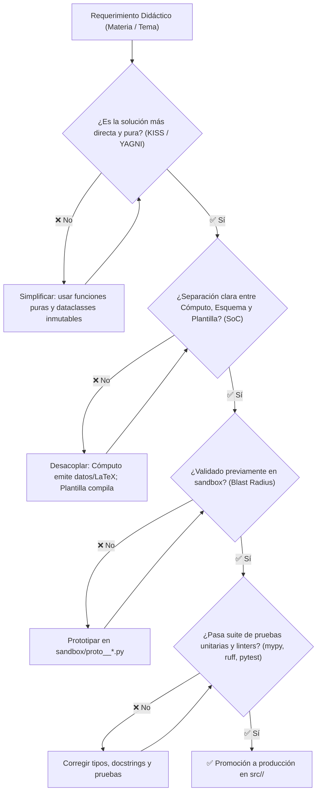

# Guía de Buenas Prácticas del Sistema de Recursos Didácticos (BUENAS_PRACTICAS.md)

Este documento establece las **directrices de ingeniería, principios fundamentales de software y buenas prácticas específicas** para el desarrollo, cálculo analítico/numérico, diagramación técnica y generación de documentos didácticos en este repositorio.

---

## 1. Marco de Decisión y Flujo de Calidad

Para mantener el código mantenible, predecible y libre de sobre-ingeniería tanto para desarrolladores como para agentes autónomos de IA, toda adición de código sigue este flujo determinista:



---

## 2. Principios Universales Básicos de Diseño

### 2.1 KISS (Keep It Simple, Stupid)
- **Regla:** Resolver los problemas con la menor cantidad de capas, abstracciones y conceptos posibles.
- **Aplicación en el Repo:**
  - Preferir funciones matemáticas puras y `@dataclass(frozen=True)` antes que jerarquías complejas de clases o patrones *Factory* innecesarios.
  - Diseñar scripts legibles y testeables con una función `main(argv)` desacoplada.
- **Checklist:**
  - [ ] ¿La función de cálculo o diagrama resuelve el problema directamente sin intermediarios innecesarios?
  - [ ] ¿Cualquier desarrollador o LLM puede entender el algoritmo sin consultar diagramas complejos?

### 2.2 YAGNI (You Aren't Gonna Need It)
- **Regla:** No implementar cálculos, métodos genéricos ni adaptadores para tecnologías no solicitadas explícitamente.
- **Aplicación en el Repo:**
  - Si el recurso requiere calcular el equivalente Thevenin, no crear una suite completa de simulación SPICE de propósito general.
  - Implementar únicamente las variables y opciones que intervienen en el material didáctico objetivo.
- **Checklist:**
  - [ ] ¿Todo parámetro y método responde a un requerimiento didáctico concreto actual?
  - [ ] ¿Se eliminaron argumentos especulativos o banderas "por si acaso"?

### 2.3 DRY & SSOT (Don't Repeat Yourself / Single Source of Truth)
- **Regla:** Cada pieza de conocimiento, fórmula o constante debe tener una única fuente autoritativa.
- **Aplicación en el Repo:**
  - Centralizar constantes físicas ($\varepsilon_0$, $\mu_0$, $c$, $e$) y configuraciones globales en módulos compartidos (`src/core/config.py` o módulo de constantes de la materia).
  - Evitar copiar y pegar expresiones LaTeX idénticas entre materias.
- **Checklist:**
  - [ ] ¿Las constantes físicas y factores de escala provienen de una única fuente centralizada?
  - [ ] ¿No se duplica código entre módulos de la misma materia?

### 2.4 Separation of Concerns (SoC) y Modularidad
- **Regla:** Separar estrictamente la lógica de cálculo matemático del diseño gráfico y de la sintaxis del motor de renderizado.
- **Aplicación en el Repo:**
  - `src/<Materia>/`: Realiza cálculos analíticos (`sympy`), numéricos (`scipy`/`numpy`) y genera esquemas vectoriales.
  - `src/core/`: Orquesta la compilación en Typst, Quarto o LaTeX vía Jinja2.
  - Ninguna función matemática debe generar directamente código Typst o Markdown concatenado a mano.
- **Checklist:**
  - [ ] ¿La lógica matemática es independiente del formato de salida final?
  - [ ] ¿El generador de plantillas recibe datos tipados o diccionarios normalizados?

### 2.5 Fail Fast & Programación Defensiva
- **Regla:** Validar precondiciones de dominio en la entrada y fallar inmediatamente con mensajes claros antes de propagar errores numéricos o sintácticos.
- **Aplicación en el Repo:**
  - Validar valores físicamente imposibles (resistencias negativas, frecuencias $\le 0$, probabilidades fuera de $[0, 1]$).
  - Prohibido silenciar errores con `except: pass` o `except Exception: return None`.
- **Checklist:**
  - [ ] ¿Se validan precondiciones y rangos de las variables al inicio de cada función?
  - [ ] ¿Se elevan excepciones explícitas de dominio (`ValueError`, `TypeError`) ante entradas no válidas?

---

## 3. Buenas Prácticas para Cómputo Científico y Simbólico

### 3.1 Desacoplamiento entre Cómputo Simbólico y Numérico
- **Simbólico (`SymPy`):** Empleado para deducción de fórmulas, integración analítica, ecuaciones diferenciales, simplificación booleana y generación de expresiones LaTeX exactas (`sympy.latex(expr)`).
- **Numérico (`NumPy` / `SciPy`):** Empleado para muestreo denso de señales, transformada de Fourier (FFT), respuesta en frecuencia analítica y resolución de sistemas de ecuaciones de alta dimensionalidad.
- **Regla de Conversión:** Usar `sympy.lambdify` para transformar soluciones analíticas exactas en funciones numéricas vectorizadas ejecutables por NumPy.

### 3.2 Pureza Funcional y Determinismo
- Todas las rutinas de cálculo deben ser **funciones puras**:
  - Mismos parámetros de entrada producen exactamente la misma salida matemática.
  - Sin efectos secundarios en variables globales, mutación de argumentos o dependencias del estado de la sesión.

### 3.3 Tipado Estricto (Python 3.10+ PEP 585 / PEP 604)
- Toda función debe declarar tipos nativos en sus argumentos y tipo de retorno explícito:
  ```python
  def calcular_impedancia_rc(
      resistencia: float,
      capacitancia: float,
      frecuencia_hz: float,
  ) -> complex:
      """Calcula la impedancia equivalente de una rama RC serie."""
      ...
  ```

---

## 4. Buenas Prácticas para Diagramación y Esquemática Vectorial

### 4.1 Enfoque Vectorial Obligatorio (*Vector-First*)
- **Invariante:** Todo diagrama esquemático de circuitos (`schemdraw`), compuertas lógicas, máquina de estados o gráfica científica DEBE exportarse en formato vectorial (**`.svg`** o **`.pdf`**).
- **Justificación:** Los formatos rasterizados (`.png`, `.jpg`) pierden nitidez, producen pixelado al imprimirse en guías o libros didácticos y no escalan adecuadamente en pantallas de alta densidad (Retina/4K).

### 4.2 Convención de Estilos y Paletas Visuales
- Mantener consistencia tipográfica y de color entre materias:
  - Fondo blanco puro o transparente para documentos impresos.
  - Líneas de circuitos con grosor uniforme (`lw=1.5` o estándar de Schemdraw).
  - Etiquetas con fuentes sans-serif legibles y símbolos matemáticos LaTeX normalizados.

### 4.3 Almacenamiento Aislado de Salidas
- Los diagramas generados nunca deben guardarse en la raíz del repositorio ni en directorios de código fuente `src/`.
- La ruta canónica de exportación es:
  `output/<materia>/assets/<nombre_esquema>.svg`

---

## 5. Buenas Prácticas para Plantillas y Compilación de Documentos

### 5.1 Desacoplamiento del Motor de Renderizado
- La lógica de negocio pedagógica emite:
  1. Resultados numéricos estructurados (tablas, parámetros calculados).
  2. Fórmulas analíticas en sintaxis LaTeX pura.
  3. Rutas relativas a los diagramas vectoriales (`.svg`/`.pdf`).
- El renderizador (`Jinja2`) inyecta estos artefactos en plantillas Typst (`.typ`) o Quarto (`.qmd`) sin que la materia conozca detalles de compilación.

### 5.2 Sanitización y Escape de Caracteres Especiales
- En LaTeX: Escapar rigurosamente caracteres especiales no matemáticos (`_`, `%`, `&`, `#`, `$`, `{`, `}`).
- En Typst: Evitar colisiones con delimitadores nativos (`#`, `@`, `*`, `_`) en cadenas de texto plano.

### 5.3 Invocación Segura de Compiladores Externos
- Toda ejecución de binarios externos (`typst compile`, `quarto render`, `pdflatex`) debe realizarse mediante funciones centralizadas con:
  - Timeout explícito parametrizable (por defecto 120s).
  - Captura completa de `stdout` y `stderr` para auditoría y diagnóstico de fallos.
  - Verificación del código de retorno (`returncode == 0`).

---

## 6. Buenas Prácticas Agénticas y Control de Estado

### 6.1 Prototipado Aislado con Blast Radius Controlado (`sandbox/`)
- Todo nuevo ejercicio, esquema o algoritmo experimental debe desarrollarse inicialmente en `sandbox/proto_<materia>_<tema>.py` o diseñarse en `state/SCRATCHPAD.md`.
- Una vez validada la exactitud matemática y visual, se promueve a `src/<Materia>/` siguiendo el ciclo de 5 pasos definido en [`sandbox/sandbox_guide.md`](file:///G:/REPOSITORIOS%20GITHUB/RECURSOS/sandbox/sandbox_guide.md).

### 6.2 Memoria y Persistencia en `state/`
- **Lecciones aprendidas:** Registrar descubrimientos de runtime o incompatibilidades en [`state/MEMORY.md`](file:///G:/REPOSITORIOS%20GITHUB/RECURSOS/state/MEMORY.md).
- **Procedimientos SOP:** Mantener recetas reproducibles paso a paso en [`state/PLAYBOOK.md`](file:///G:/REPOSITORIOS%20GITHUB/RECURSOS/state/PLAYBOOK.md).
- **Telemetría:** Registrar hitos con marca temporal UTC en [`state/PROGRESS.md`](file:///G:/REPOSITORIOS%20GITHUB/RECURSOS/state/PROGRESS.md).

---

## 7. Checklist de Aceptación para Módulos Didácticos (DoD)

Antes de considerar completado un recurso o módulo didáctico en `src/`:

- [ ] **Exactitud Científica:** Los cálculos analíticos (`sympy`) y numéricos (`numpy`/`scipy`) han sido verificados contra casos de prueba conocidos.
- [ ] **Salida Vectorial:** Todos los diagramas y circuitos están guardados en `.svg` o `.pdf` con tipografía clara.
- [ ] **Tipado Estricto:** Código validado con `mypy --strict` sin errores de tipo ni variables sin anotar.
- [ ] **Docstrings Google Style:** Módulos, clases y funciones cuentan con docstrings completos (`Args:`, `Returns:`, `Raises:`).
- [ ] **Pruebas Automatizadas:** Existen pruebas unitarias en `tests/` que validan el módulo en condiciones normales y con entradas límite.
- [ ] **Metadatos Sincronizados:** Si se genera documentación Markdown, cuenta con frontmatter YAML válido verificado por `tests/validate_metadata.py`.
