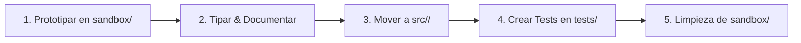

# Directorio de Sandbox y Experimentación Aislada (sandbox/)

> [!WARNING]
> **Espacio Efímero y Desechable:** El contenido de este directorio está destinado exclusivamente a pruebas de concepto, prototipos de cálculo analítico/numérico, bocetos de esquemas vectoriales (`schemdraw`), **planes de ejecución temporales (`plan_*.md`)** y pruebas de compilación de plantillas (`Typst`, `Quarto`, `LaTeX`).

---

## 1. Propósito y Alcance en el Repositorio

Este directorio permite a desarrolladores y agentes de IA experimentar con seguridad (*Blast Radius Controlado*) antes de mutar los módulos definitivos en `src/`:

- **Planes Temporales de Ejecución:** Todo borrador de diseño o plan de trabajo transitorio (`plan_*.md`) se formula aquí o en `state/SCRATCHPAD.md`.
- **Circuitos:** Validar conexiones de componentes y diagramas Schemdraw en scripts independientes (`proto_circuitos_rlc.py`).
- **Electromagnetismo:** Probar campos vectoriales y mapas 2D/3D con Matplotlib/Plotly sin afectar el pipeline principal.
- **Telecomunicaciones:** Verificar algoritmos de FFT, modulación y diagramas de constelación.
- **VHDL:** Probar simplificaciones booleanas complejas y emisión de código sintetizable.
- **Exportación:** Probar comandos de compilación Typst y Quarto hacia formatos de salida temporales.

---

## 2. Reglas Operativas Inviolables

1. **Aislamiento Estricto:** Los archivos generados en `sandbox/` están excluidos del control de versiones (`.gitignore`) y **NUNCA** deben ser importados desde `src/` ni desde `tests/`.
2. **Convención de Nomenclatura:** Todos los prototipos deben nombrarse siguiendo el patrón:
   - `proto_<materia>_<descripcion>.py` (ej. `proto_circuitos_bode.py`, `proto_vhdl_fsm.py`).
   - `repro_<problema>.py` para reproducir bugs o fallos de librerías.
3. **Cero Secretos:** No colocar credenciales, tokens ni rutas absolutas fuera del workspace en scripts de prueba.

---

## 3. Ciclo de Promoción a `src/` en 5 Pasos

1. **Prototipar:** Desarrollar el cálculo o esquema y verificar la salida visual/numérica.
2. **Tipar & Documentar:** Agregar Type Hints PEP 585/604 y Google Style Docstrings.
3. **Mover a `src/`:** Integrar la función o clase en el módulo correspondiente (`src/Circuitos/`, `src/VHDL/`, etc.).
4. **Tests Unitarios:** Crear pruebas automatizadas con `pytest` en `tests/`.
5. **Limpieza:** Eliminar el script `proto_*.py` de `sandbox/`.
