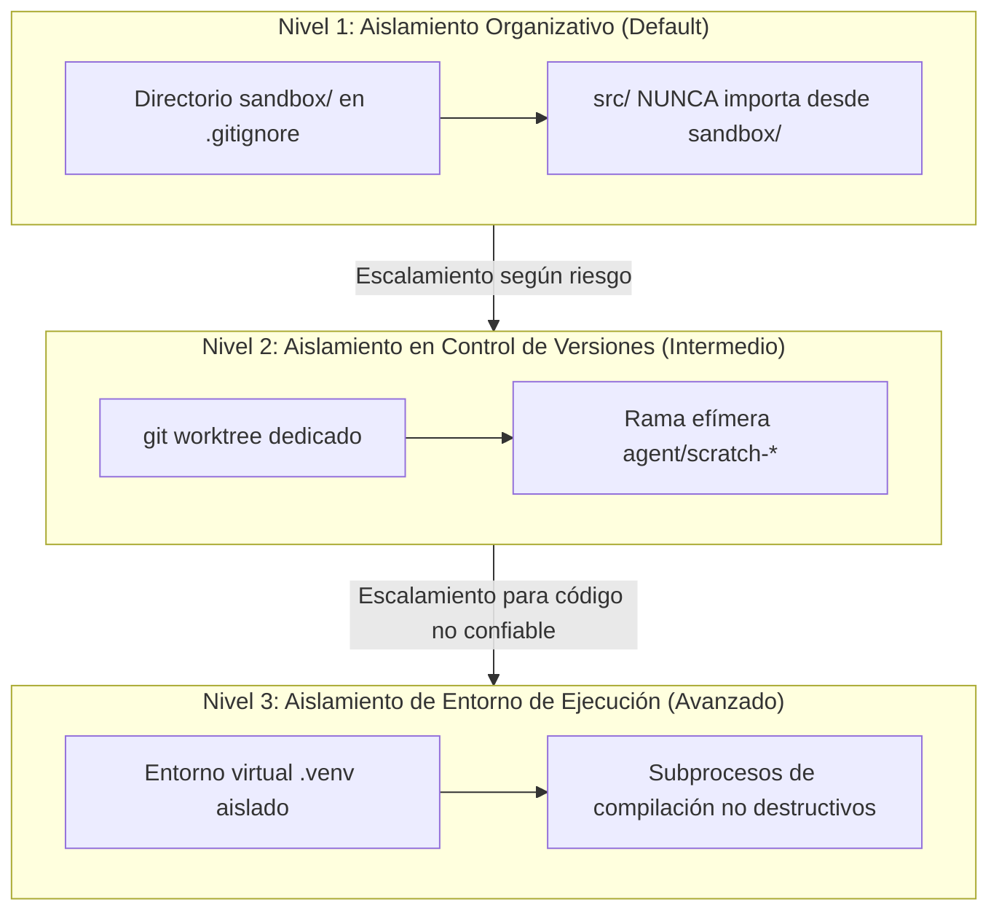
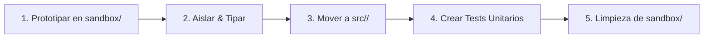

# Guía de Sandboxing y Blast Radius Controlado (sandbox_guide.md)

Este documento define la **política de aislamiento, niveles de contención de riesgos y el ciclo de promoción de código** para experimentos y prototipos didácticos generados por humanos o agentes de IA.

---

## 1. Filosofía: Blast Radius Controlado

El sistema implementa un modelo formal de **Blast Radius Controlado** graduado en 3 niveles de contención técnica y organizativa:

---

## 2. Los 3 Niveles de Aislamiento

1. **Nivel 1: Aislamiento Organizativo (Estándar para Prototipos Didácticos)**
   - El directorio `sandbox/` está excluido de Git mediante `.gitignore` (excepto su `README.md`, `.gitignore` y `sandbox_guide.md`).
   - `MUST_NOT`: Ningún módulo en `src/` o `tests/` puede importar código ubicado en `sandbox/`.
2. **Nivel 2: Aislamiento de Control de Versiones (Para Refactorizaciones Mayores)**
   - Uso de `git worktree` o ramas temporales (`agent/scratch-<id>`) para evitar ensuciar el árbol de trabajo principal.
   - Permite descartar o fusionar selectivamente los cambios experimentales.
3. **Nivel 3: Aislamiento de Entorno de Ejecución (Para Scripts No Confiables o de Estrés)**
   - Ejecución dentro de subprocesos aislados sin privilegios administrativos.
   - Variables de entorno locales sin alterar configuraciones del sistema host.

---

## 3. Protocolo de Promoción a Producción en 5 Pasos

Todo código originado en `sandbox/` que deba incorporarse a la base de código principal DEBE seguir este ciclo formal:

1. **Paso 1 (Prototipado):** Desarrollar y verificar empíricamente la solución en `sandbox/proto_<materia>_<tema>.py`.
2. **Paso 2 (Aislamiento y Tipado):** Añadir anotaciones de tipo PEP 585/604 completas, docstrings y manejo de excepciones de dominio.
3. **Paso 3 (Migración a `src/`):** Mover el archivo o funciones al paquete canónico en `src/` (`src/Circuitos/`, `src/VHDL/`, etc.).
4. **Paso 4 (Cobertura de Pruebas):** Escribir pruebas automatizadas en `tests/` que validen casos de éxito y de borde.
5. **Paso 5 (Limpieza):** Eliminar los archivos temporales de `sandbox/` para no dejar residuos.
