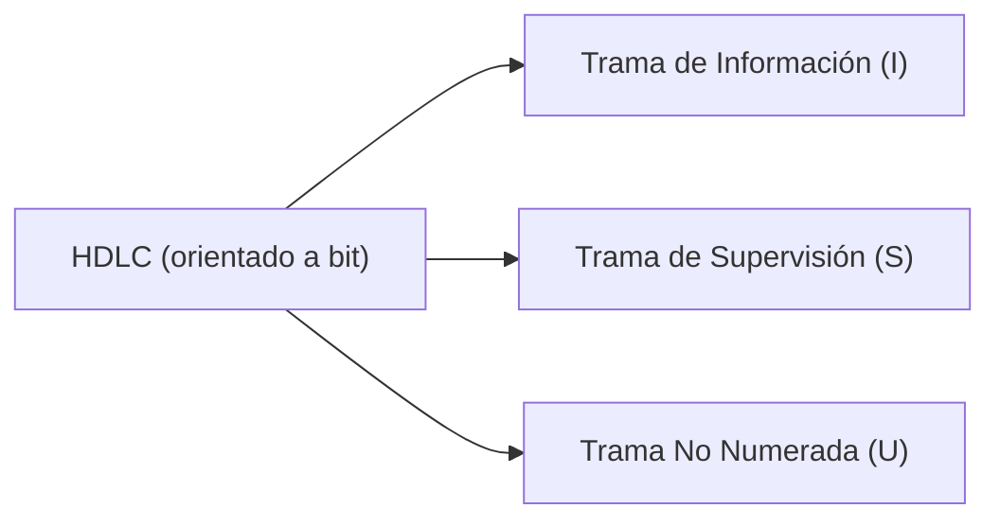
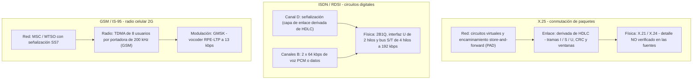

# TAREA 1 — ERA III: DIGITALIZACIÓN Y TELEFONÍA MÓVIL INICIAL

**Materia:** Telecomunicaciones · **Actividad:** Act1 — Eras Tecnológicas · **Caso de estudio:** Redes X.25, ISDN (RDSI) y telefonía celular 1G/2G (GSM / CDMA)

---

## 0. Criterio de verificación y trazabilidad

Documento derivado de `src/Telecomunicaciones/ERA_3_NOTEBOOK.md` (cuaderno *Digital Communications: Systems, Theory, and Infrastructure*). Reglas de depuración aplicadas:

1. **Sólo se conserva lo que el cuaderno atribuye explícitamente a las tres fuentes** de la libreta bibliográfica.
2. **Se descarta del cuerpo todo pasaje que el propio cuaderno marcó como "información no disponible en tus fuentes"**, junto con los ofrecimientos de búsqueda web. Los huecos detectados se inventarían en el Anexo A (sin datos) para orientar la consulta de fuentes primarias.
3. **No se incorpora información de origen externo** (normas ITU-T / 3GPP / TIA consultadas en web o valores de ingeniería no citados por la bibliografía), para no atribuir a las fuentes contenido que no proviene de ellas.
4. **El detalle técnico que apareció dentro de respuestas no verificadas** (por ejemplo, el desglose bit a bit de tramas LAPD, cuyo nivel de detalle las fuentes no cubren) se traslada al Anexo A como *pendiente de verificación*, no como hallazgo.

**Estado global de la extracción:** 6 de 7 bloques de preguntas del cuaderno aportaron información atribuible a las fuentes (Fases 1, 2 y 4 completas; Fases 3 y 5 parciales). Las citas con número de página quedan pendientes porque el cuaderno no las registra.

---

## 1. Fase 1 — Contexto histórico y cronología

> **Prompt:** *"¿Cuáles son los hitos históricos, fechas de estandarización e implementación masiva de las redes X.25, ISDN (RDSI) y la telefonía móvil 1G (AMPS/TACS) y 2G (GSM y CDMA/IS-95)? Explica qué limitaciones técnicas de la telefonía analógica motivaron la transición hacia la conmutación de paquetes y la digitalización."*

### 1.1 Limitaciones de la telefonía analógica que motivaron la transición

| Limitación | Descripción según las fuentes | Consecuencia técnica |
|:---|:---|:---|
| Ancho de banda restringido | La red telefónica conmutada (PSTN) fue diseñada para voz en un canal de 300 a 3400 Hz (≈3.4 kHz). | Las armónicas de alta frecuencia de las señales digitales sufren atenuación severa, distorsión de fase e interferencia intersimbólica (ISI). |
| Ineficiencia de la conmutación de circuitos | Una vez establecida la llamada se reserva un circuito físico exclusivo entre los dos extremos durante toda la conexión. | Las pausas y silencios no pueden ser aprovechados por otros usuarios: capacidad de red desperdiciada. |
| Acumulación de ruido | En enlaces analógicos de larga distancia el ruido del medio se acumula en cada amplificador intermedio. | Degradación progresiva y acumulativa de la calidad de la señal. |

### 1.2 Motores de la digitalización y de la conmutación de paquetes

- **Repetidores regenerativos:** la digitalización permite limpiar y reconstruir la señal de pulso en cada tramo, evitando la acumulación de ruido.
- **Conmutación de paquetes** (bases teóricas atribuidas por las fuentes a Paul Baran, Leonard Kleinrock y Donald Davies): la información se divide en bloques independientes con cabeceras de direccionamiento. Esto elimina la necesidad de reservar un circuito dedicado continuo, habilita el enrutamiento dinámico por la ruta más conveniente y optimiza el ancho de banda al compartir una misma línea de alta velocidad entre varios usuarios simultáneos.

### 1.3 Cronología verificada

| Fecha / periodo | Hito atribuido a las fuentes |
|:---|:---|
| 1947 | Formulación del concepto celular en Bell Labs. |
| 1973 | Primera llamada desde un prototipo celular de mano (Martin Cooper, Motorola). |
| Marzo de 1976 | El CCITT (actual ITU-T) aprueba el estándar **X.25** de conmutación de paquetes. |
| 1978 | Instalación de la primera red celular de prueba en Chicago. |
| 1978 / 1981 | Operación de la red internacional de datos IPSS (X.25). |
| Finales de 1970 – década de 1980 | Difusión masiva de X.25 en redes internacionales de datos de negocios, redes WAN y terminales satelitales (VSAT). |
| 1982 | La ETSI fija **GSM** como estándar europeo. Comienza la operación de los sistemas **NMT/TACS** (países nórdicos). |
| 1982 – 1983 | La FCC autoriza el uso comercial de **AMPS** en Estados Unidos. |
| 1985 | Introducción comercial del estándar **TACS** británico. |
| Décadas de 1970 a 1990 | Investigación y maduración del concepto de **RDSI / ISDN**; la variante de velocidad básica (N-ISDN) define 144 kbps (2 canales B de 64 kbps + 1 canal D de 16 kbps) con señalización multinivel **2B1Q** a 160 kbps. |
| 1990 | Disponibilidad comercial de **ISDN**. Despliegue comercial inicial de **GSM** en Europa y Asia (roaming internacional, SMS y datos a 9600 bps). |
| 1992 | El CCITT es renombrado **ITU-T**. |
| 1993 | Aprobación de **CDMA (IS-95)** en Estados Unidos e implementación en la banda de 900 MHz mediante códigos de ensanchado ortogonales. |

### 1.4 Observaciones de consistencia detectadas en el cuaderno

- El cuaderno expande **AMPS** como *American Mobile Phone System*; conviene contrastar la expansión exacta del acrónimo en la fuente primaria antes de reproducirla.
- Se registran **1982** como fecha de fijación del estándar GSM por la ETSI y **1990** como inicio del despliegue comercial; ambas fechas deben cotejarse en el capítulo correspondiente de la bibliografía.
- La adaptación española del 1G se documenta como **TMA-450** y posteriormente **E-TACS / MoviLine** en 900 MHz.
- **Contraste externo de fechas:** las fechas de este apartado reproducen lo declarado por las fuentes de la libreta. Su verificación contra obras de referencia externas y los ajustes resultantes (creación del grupo GSM en la CEPT en 1982 frente a la ETSI, despliegue comercial de GSM en 1991, estandarización de la RDSI en 1988, despliegue de IS-95 en 1995 y apertura de NMT en 1981) se documentan en `src/Telecomunicaciones/LINEA_DEL_TIEMPO.md` (§3).

---

## 2. Fase 2 — Arquitectura de protocolos y señalización

### 2.1 X.25

> **Prompt:** *"Describe la arquitectura en capas de X.25 (Capa Física X.21/X.24, Capa de Enlace LAPB y Capa de Red Packet Level Protocol - PLP). ¿Cómo gestiona el control de flujo y la corrección de errores circuito a circuito?"*

- **Capa de red (orientada a conexión):** el estándar fue aprobado por el CCITT en marzo de 1976 y opera sobre **circuitos virtuales** que emulan conexiones telefónicas tradicionales. En las subredes de conmutación de paquetes por almacenamiento y reenvío (*store-and-forward*) la capa de red encamina los paquetes y garantiza su transporte a través de procesadores o enrutadores intermedios. La integración de terminales se realiza mediante empaquetadores/desempaquetadores de datos (**PAD**).
- **Capa de enlace:** las fuentes describen protocolos de enlace derivados de **HDLC** (*High-level Data Link Control*), orientado a bit, cuya función es convertir una línea física propensa a errores en un canal libre de errores mediante el empaquetado en tramas y el intercambio de acuses de recibo. HDLC utiliza tres tipos de trama: de **Información (I)**, de **Supervisión (S)** y **No numeradas (U)**.
- **Control de flujo y corrección de errores circuito a circuito:** a diferencia de protocolos sin conexión como IP (que delega la verificación en los extremos), X.25 verifica **tramo a tramo en cada nodo intermedio**:
  - *Errores:* códigos de redundancia/comprobación (*checksum* o CRC) y números de secuencia en cada trama; ante trama corrupta o perdida, los nodos intermedios gestionan el reenvío con tramas de asentimiento/rechazo.
  - *Flujo:* campos de secuencia $N(S)$ (número enviado) y $N(R)$ (número esperado) en el encabezado de control, con negociación por **ventanas deslizantes**, impidiendo que el emisor desborde la capacidad del receptor en cada enlace individual.

### 2.2 ISDN (RDSI)

> **Prompt:** *"¿Cómo se estructura la interfaz ISDN en acceso básico (BRI: 2B+D a 144 kbps) y primario (PRI: 23B+D / 30B+D)? Explica los protocolos de señalización de canal D (LAPD / Q.921 y Q.931) y su integración con SS7 (Signaling System No. 7)."*

#### Acceso de Velocidad Básica (BRI)

| Elemento | Valor verificado |
|:---|:---|
| Composición | 2B + D |
| Canales B (*Bearer*) | 2 canales de 64 kbps para datos de usuario (voz digitalizada PCM, vídeo o datos). |
| Canal D (*Delta*) | 1 canal de 16 kbps dedicado a señalización (establecimiento, enrutamiento, control y desconexión de llamadas) e información de red. |
| Velocidad útil | 144 kbps (64 + 64 + 16 kbps). |
| Tasa en línea (interfaz U) | 160 kbps dúplex: la red añade 12 kbps de sincronización de tramas y 4 kbps de gestión de red. |
| Codificación y físicas | Código de línea multinivel **2B1Q** (dos bits por símbolo cuaternario) a 80 kbauds sobre par trenzado de cobre. La terminación de red (NT1) convierte el circuito de 2 hilos (interfaz U) en un bus de 4 hilos (interfaces S/T) a 192 kbps con codificación bipolar. |

#### Acceso de Velocidad Primaria (PRI)

| Variante | Estructura y capacidad |
|:---|:---|
| Norteamericana / japonesa (1.544 Mbps, T1 / DS-1) | 23B + D: 23 canales B de 64 kbps y 1 canal D de 64 kbps para señalización. |
| Europea / ITU (2.048 Mbps, E1) | 30B + D sobre jerarquía TDM PCM de 30+2 canales: 30 canales B de 64 kbps para tráfico útil, intervalo de tiempo 16 (TS16) como canal D de señalización a 64 kbps e intervalo de tiempo 0 (TS0) para sincronismo de trama. |

#### Canal D y SS7 (alcance real de las fuentes)

- **Verificado:** el **canal D** es el canal dedicado a la transmisión de señalización y control de las conexiones de los canales B; las capas de enlace asociadas derivan del estándar **HDLC** (tramas de Información, Supervisión y No numeradas) para el intercambio de acuses de recibo, números de secuencia y control de flujo.
- **No verificado:** la pila de señalización del canal D (**LAPD / Q.921** y **Q.931**) y el procedimiento de mapeo/traducción de la señalización de acceso hacia la red troncal **SS7**. Las fuentes de la libreta no cubren ese nivel de detalle (véase Anexo A).

### 2.3 Telefonía celular 2G — GSM

> **Prompt:** *"Detalla la arquitectura de red GSM (BSS, NSS, BTS, BSC, MSC, HLR, VLR). Explica la diferencia operativa entre canales de control (BCCH, SDCCH) y canales de tráfico (TCH)."*

**Caracterización del sistema (verificada):** GSM se define como el estándar de telefonía celular digital fijado por la ETSI en 1982. Utiliza acceso múltiple por división de tiempo (**TDMA**) con 8 usuarios por canal de radio de 200 kHz, modulación **GMSK** a 270.833 kbps, codificación de voz **RPE-LTP** a 13 kbps, identificación del usuario mediante **tarjeta inteligente (SIM)** y señalización basada en **SS7**.

**Componentes descritos en las fuentes:**

| Componente | Función verificada |
|:---|:---|
| Estaciones base / centrales de célula (infraestructura de radio, asociada a BTS) | El territorio se divide en celdas pequeñas, cada una con antena y central local; gestionan la transmisión y recepción de radiofrecuencia con los terminales móviles. |
| Centro Móvil de Conmutación (MSC / MTSO) | Central computarizada de control de la red: coordina las estaciones base; conmuta llamadas hacia la red fija (PSTN / RDSI) o hacia otros móviles; gestiona la radiolocalización (*paging*); monitorea el nivel de señal y coordina la transferencia de canal (*handoff*) sin interrumpir la llamada; administra la itinerancia (*roaming*) y la interconexión con servicios de red inteligente; graba datos de llamadas y procesa la facturación. |

**Canales de control frente a canales de tráfico:**

| Categoría | Función | Operación |
|:---|:---|:---|
| Canales de control (señalización y gestión) | Transportan información de control, señalización fuera de banda y comandos de red. | Localizan el teléfono (*paging*), transmiten identificadores del terminal y envían los mensajes de asignación del canal de voz antes de iniciar la llamada. |
| Canales de tráfico / voz | Transportan el tráfico útil: datos o voz digitalizada. | Completada la señalización en el canal de control, el MSC asigna un intervalo de tiempo (*timeslot*) de la trama TDMA; el móvil se sintoniza a ese canal para la conversación bidireccional. |

> **Alcance:** las denominaciones **BSS**, **NSS**, **BTS**, **BSC**, **HLR**, **VLR**, **BCCH**, **SDCCH** y **TCH** no aparecen en las fuentes de la libreta (véase Anexo A).

---

## 3. Fase 3 — Capa física, modulaciones y multiplexación

> **Prompt:** *"Resume las características físicas y de espectro de la Era III: medios, modulaciones, multiplexación/acceso y digitalización de voz."*

El cuaderno **no contiene una respuesta propia a esta fase**; los datos siguientes se recuperan de los bloques verificados de las Fases 1, 2 y 4. Los puntos del prompt sin respaldo documental se listan al final de la sección.

### 3.1 Medios de transmisión

| Medio | Dato verificado |
|:---|:---|
| Par trenzado de cobre (ISDN) | Interfaz U de 2 hilos a 160 kbps con código 2B1Q a 80 kbauds; el NT1 entrega un bus S/T de 4 hilos a 192 kbps con codificación bipolar. |
| Radiofrecuencia (celular) | 900 MHz verificado para NMT/TACS, E-TACS/MoviLine y CDMA IS-95; banda PCS de 1.9 GHz verificada para IS-95. |

### 3.2 Modulaciones

| Sistema | Esquema verificado |
|:---|:---|
| 1G (AMPS / TACS / NMT) | Interfaz de radio analógica con modulación **FM**. |
| GSM (2G) | **GMSK** (*Gaussian Minimum Shift Keying*) con producto de ancho de banda por tiempo de bit $BT_b = 0.3$. |

### 3.3 Multiplexación y acceso al medio

- **TDMA (GSM):** canal de radio de 200 kHz organizado en intervalos de tiempo para 8 usuarios.
- **CDMA (IS-95):** canales de radio de 1.2 MHz en 900 MHz y PCS de 1.9 GHz; asignación de **secuencias de códigos de ensanchado ortogonales** (código PN) a cada usuario, lo que permite compartir simultáneamente la misma banda de frecuencia, reutilizar canales en células adyacentes y multiplicar la capacidad de usuarios por celda frente a sistemas analógicos o TDMA.

### 3.4 Digitalización de voz

| Tecnología | Parámetro verificado |
|:---|:---|
| ISDN (RDSI) | Canal B de 64 kbps con **voz digitalizada PCM** dentro de la jerarquía TDM. |
| GSM | Vocoder **RPE-LTP** (*Regular Pulse Excitation - Long Term Prediction*) a 13 kbps; transmisión de datos a 9600 bps. |

### 3.5 Puntos del prompt sin respaldo en las fuentes

QPSK y FSK como modulaciones de la Era III; uso de **líneas dedicadas o coaxial** en X.25; bandas de 800 MHz y 1800 MHz; denominación explícita de **códigos Walsh**. No se incorporan datos externos; se registran como brecha en el Anexo A.

---

## 4. Fase 4 — Normatividad y estándares internacionales

> **Prompt:** *"Genera una lista de los organismos reguladores y los estándares formales de la Era III citados en la literatura (CCITT/ITU-T para X.25 y series I/Q para ISDN; ETSI/3GPP para GSM; TIA/EIA IS-95 para CDMA). Incluye el propósito técnico de cada norma."*

### 4.1 CCITT / ITU-T

Organismo: Comité Consultivo Internacional de Telegrafía y Telefonía, renombrado **ITU-T** en 1992. Órgano especializado de la Unión Internacional de Telecomunicaciones (UIT), agencia de la ONU que formula recomendaciones técnicas y estándares globales para sistemas telefónicos, redes públicas y comunicación de datos.

| Norma / familia | Propósito técnico verificado |
|:---|:---|
| **X.25** | Definir la interfaz de red para conmutación de paquetes orientada a conexión sobre circuitos virtuales que emulan conexiones telefónicas, garantizando transporte de datos confiable en redes WAN y entornos corporativos. |
| **Series para ISDN / RDSI** | Normalizar la integración de voz, vídeo y datos en una sola línea digital de suscriptor mediante canalización TDM (canales B de 64 kbps para tráfico útil y canal D para señalización). |
| **Recomendaciones V** (V.22bis, V.32, V.34, V.90) | Normalizar métodos de modulación analógica/digital, compresión de datos y protocolos de control de errores para la transmisión de datos por módems sobre la PSTN. |
| **Jerarquía digital TDM** (2.048 Mbps / E1) | Establecer la jerarquía de multiplexación por división de tiempo internacional (fuera de EE. UU. y Japón) para combinar canales de voz de 64 kbps en tramas digitales de alta velocidad. |

> La designación concreta de las **series I y Q** para ISDN se menciona en el prompt pero **no** queda respaldada por las fuentes; éstas se refieren genéricamente a las "series para ISDN/RDSI".

### 4.2 ETSI y 3GPP

| Organismo | Norma / proyecto | Propósito técnico verificado |
|:---|:---|:---|
| ETSI (European Telecommunications Standards Institute) | **GSM** | Especificar la 2G celular digital con acceso **TDMA** y modulación GMSK, con objetivos de: óptima utilización del espectro, privacidad y seguridad mediante cifrado, integración de señalización SS7 e ISDN e itinerancia internacional (*roaming*). |
| 3GPP (3G Partnership Project) | **UMTS / W-CDMA** | Coordinar el desarrollo mundial de la 3G para ofrecer una arquitectura global con soporte multimedia, acceso a Internet de alta velocidad y velocidades de hasta 2 Mbps. Alianza que integra a ETSI, UIT-T, ARIB y ANSI. |

### 4.3 TIA / EIA

| Norma | Propósito técnico verificado |
|:---|:---|
| **IS-95 (CDMA norteamericano)** | Definir la 2G celular digital basada en CDMA sobre canales de radio de 1.2 MHz en la banda de 900 MHz y PCS de 1.9 GHz, con secuencias de códigos de ensanchado ortogonales (código PN) asignadas a cada usuario; permite compartir la misma banda simultáneamente, reutilizar canales en células adyacentes y multiplicar la capacidad por celda frente a sistemas analógicos o TDMA. Desarrollado por Qualcomm junto a TIA/EIA. |
| **TIA/EIA-568 (A/B)** | Especificar las normas universales de cableado estructurado comercial (par trenzado UTP y fibra óptica): parámetros de transmisión, categorías y conectores independientes del fabricante. |

---

## 5. Fase 5 — Datos para ingeniería inversa y simulación

### 5.1 Estructura de tramas

> **Prompt:** *"Proporciona el formato exacto de campos (Flag, Address, Control, Information, FCS) de una trama HDLC/LAPB en X.25 o LAPD en ISDN para realizar un diagrama de flujo o captura simulada."*

**Verificado en las fuentes:** el enlace de X.25 y el canal D de ISDN derivan de **HDLC**, protocolo orientado a bit que delimita la información en tramas y clasifica la señalización en tres tipos.

**Verificado:** la detección y el reenvío de errores se apoyan en códigos de redundancia (*checksum* / CRC), números de secuencia y tramas de asentimiento o rechazo, con control de flujo por ventanas deslizantes sobre los campos $N(S)$ y $N(R)$.

> El control de errores y de flujo se aplica **en cada enlace individual** de la trayectoria (circuito a circuito), no de extremo a extremo.

**No verificado:** el formato exacto de campos (Flag `0x7E`, octetos de dirección, SAPI/TEI, bits EA, FCS CRC-16, longitudes por octeto), junto con la denominación **LAPB** y la estructura de paquetes **PLP**, exceden el nivel de detalle de las fuentes (Anexo A). El diagrama ASCII de trama que aparecía en el cuaderno se descarta por no ser verificable y por la prohibición de diagramas informales.

### 5.2 Parámetros de radio y de enlace

> **Prompt:** *"¿Qué parámetros o comandos AT (modem GSM), tiempos de slot TDMA (4.615 ms por trama) o secuencias de prueba de señal se pueden extraer para simular un enlace GSM o decodificar tramas digitales?"*

| Parámetro | Valor verificado |
|:---|:---|
| Acceso múltiple (GSM) | TDMA con 8 usuarios por canal de radio de 200 kHz. |
| Modulación y tasa bruta (GSM) | GMSK con $BT_b = 0.3$; 270.833 kbps en la interfaz de radio. |
| Codificación de voz (GSM) | RPE-LTP a 13 kbps. |
| Datos (GSM) | 9600 bps. |
| Portadora (CDMA IS-95) | 1.2 MHz, en 900 MHz y PCS 1.9 GHz, con códigos de ensanchado ortogonales. |
| Identificación de usuario | Tarjeta inteligente (SIM). |

> El desglose de la trama TDMA de GSM (4.615 ms por trama y 0.577 ms por slot) **no** aparece en las fuentes.

### 5.3 Comandos AT y registros S

Las fuentes describen el lenguaje de comandos **AT (estándar Hayes)** y la gestión de la interfaz DTE-DCE:

| Comando / registro | Función documentada |
|:---|:---|
| `ATD` | Discado. |
| `ATA` | Respuesta. |
| `ATH` | Desconexión (colgado). |
| `ATZ` | Reinicio de configuración. |
| `ATO` | Retorno al estado de datos. |
| Registro `S0` | Definición de respuesta automática. |
| Registro `S7` | Tiempo máximo de espera de portadora. |

> **Alcance:** estos comandos documentan módems para la PSTN analógica, **no** la extensión de comandos celulares GSM (p. ej. los definidos en 3GPP TS 27.007), ausente en las fuentes.

### 5.4 Secuencias de prueba y sincronización

| Recurso | Función verificada |
|:---|:---|
| Secuencias de entrenamiento / preámbulos | Patrones de bits conocidos insertados en la trama para que el ecualizador del receptor se adapte y reduzca la interferencia intersimbólica (ISI) del canal. |
| Secuencias pseudoaleatorias (PN) | Códigos de longitud máxima empleados para lograr la sincronización de trama en el receptor mediante correlación cruzada digital. |
| Patrones deterministas | Secuencias alternadas (como `101010`) para verificar la respuesta espectral y evaluar la tasa de error en bit (BER). |

---

## 6. Matriz comparativa X.25 | ISDN | GSM/CDMA

| Criterio | X.25 | ISDN (RDSI) | GSM / CDMA (2G) |
|:---|:---|:---|:---|
| Conmutación | Paquetes, orientado a conexión mediante circuitos virtuales; subredes *store-and-forward*. | Circuitos digitales integrados con canalización TDM sobre la línea de abonado. | Radio celular digital; voz por conmutación de circuitos y señalización SS7 en la red. |
| Velocidad verificada | No declarada en las fuentes. | 144 kbps útiles (BRI); 160 kbps brutos en la interfaz U; 1.544 Mbps (23B+D) y 2.048 Mbps (30B+D) en PRI. | 270.833 kbps brutos de radio; 13 kbps de voz por vocoder; 9600 bps de datos. |
| Ancho de banda / espectro | No declarado en las fuentes. | 2 canales B de 64 kbps + canal D de 16 kbps (BRI); canal D de 64 kbps en PRI. | 200 kHz por portadora TDMA con 8 usuarios; portadora CDMA de 1.2 MHz en 900 MHz y PCS 1.9 GHz. |
| Medio de transmisión | No declarado en las fuentes. | Par trenzado de cobre: interfaz U de 2 hilos (2B1Q) y bus S/T de 4 hilos. | Radiofrecuencia; 900 MHz verificado para NMT/TACS, E-TACS/MoviLine e IS-95. |
| Protocolo de enlace | Derivado de HDLC (tramas I, S y U) con CRC, acuses y secuencias. | Capa de enlace derivada de HDLC sobre el canal D. | No verificado a nivel de enlace; acceso radio TDMA. |
| Control de errores y flujo | Tramo a tramo en cada nodo intermedio: CRC, números de secuencia, ventanas deslizantes y tramas de asentimiento/rechazo. | Derivado de HDLC: acuses de recibo, números de secuencia y control de flujo. | No verificado en las fuentes. |
| Modulación / codificación de línea | No verificado. | 2B1Q multinivel a 80 kbauds; 192 kbps con codificación bipolar en S/T. | GMSK con $BT_b = 0.3$; FM analógica en los sistemas 1G. |

---

## 7. Insumos visuales para la entrega

Pilas de protocolo comparadas, con el detalle no respaldado por las fuentes marcado explícitamente:

---

## 8. Referencias (APA 7)

### 8.1 Auditoría de formato de las fuentes

| Referencia tal como aparece en el cuaderno | Conformidad estructural APA 7 | Observación |
|:---|:---|:---|
| Clark, J. C., Villarreal, G., & Miralles, F. (2020). *Comunicaciones digitales* (1.ª ed.). Universitas. | Autor, año, título en cursiva y casa editorial en el orden correcto; ampersand antes del último autor correcto; sin lugar de publicación, conforme a APA 7. | La mención de edición es redundante: APA 7 sólo indica la edición cuando **no** es la primera. Los registros de catálogo consignan la casa editora como "Jorge Sarmiento Editor - Universitas"; si la portada incluye ambas, se separan con punto y coma. |
| Martín Pereda, J. A. (2022). *Historia de las telecomunicaciones*. Editorial Guadalmazán. | Estructura correcta; datos confirmados (Guadalmazán, 2022). | La designación "Editorial" se omite según APA 7 (términos de estructura empresarial): queda "Guadalmazán". |
| Couch, L. W., II. (2008). *Sistemas de comunicación digitales y analógicos* (7.ª ed., R. J. Romero Elizondo, trad.). Pearson Educación. | Sufijo "II." correctamente ubicado tras las iniciales; edición y traductor dentro del mismo paréntesis; datos confirmados (Pearson / Prentice Hall, 2008). | Dentro del paréntesis los elementos se separan con punto y coma y la abreviatura se capitaliza: "(7.ª ed.; R. J. Romero Elizondo, Trad.)". Se recomienda añadir la fecha de la obra original si se localiza la edición en inglés. |

**Ajustes adicionales de la lista:** ordenar alfabéticamente (Clark → Couch → Martín Pereda) y unificar el estilo de las abreviaturas de edición y traducción.

### 8.2 Lista de referencias normalizada

Clark, J. C., Villarreal, G., & Miralles, F. (2020). *Comunicaciones digitales*. Universitas.

Couch, L. W., II. (2008). *Sistemas de comunicación digitales y analógicos* (7.ª ed.; R. J. Romero Elizondo, Trad.). Pearson Educación.

Martín Pereda, J. A. (2022). *Historia de las telecomunicaciones*. Guadalmazán.

---

## Anexo A — Brechas de verificación (información descartada del cuerpo)

Contenido que el cuaderno marcó como **no disponible en las fuentes** o que excede el nivel de detalle documentado. Se conserva únicamente el identificador del hueco, sin datos, para orientar la consulta de fuentes primarias.

| Fase | Brecha detectada | Fuente normativa sugerida para completarla |
|:---|:---|:---|
| 2.1 | Especificaciones mecánicas y eléctricas de la capa física X.21 / X.24; procedimiento LAPB; estructura interna de los paquetes PLP. | Recomendaciones ITU-T de la serie X. |
| 2.2 | Pila del canal D: LAPD / Q.921 y Q.931; mapeo de la señalización de acceso hacia la red troncal SS7 (ISUP). | Recomendaciones ITU-T de las series I y Q. |
| 2.3 | Subsistemas BSS y NSS; módulos BTS y BSC; bases HLR y VLR; canales lógicos BCCH, SDCCH y TCH. | Especificaciones 3GPP / ETSI de GSM. |
| 3 | Modulaciones QPSK y FSK en la Era III; medio coaxial o líneas dedicadas en X.25; bandas de 800 MHz y 1800 MHz; denominación de códigos Walsh. | Bibliografía de capa física y normativa de espectro. |
| 5.1 | Formato exacto de campos de trama (Flag, Address, Control, Information, FCS), bits SAPI/TEI/EA, CRC-16, y longitudes por octeto. | ITU-T X.25 / Q.921. |
| 5.2 | Trama TDMA de GSM (4.615 ms por trama, 0.577 ms por slot); comandos AT celulares; estructura de las secuencias de entrenamiento (TSC) en las ráfagas. | 3GPP TS 27.007 y series 45.xxx / 05.xxx. |
