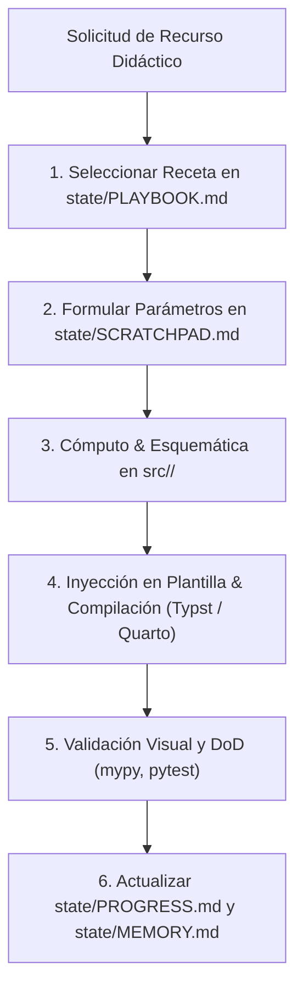

# Procedimientos Operativos Estandarizados (state/PLAYBOOK.md)

Este documento define las recetas operativas paso a paso para la generación de recursos didácticos por materia escolar y la compilación de documentos.

---

## 1. Flujo de Ejecución de Procedimientos

---

## 2. Receta 1: Creación de Recurso para Circuitos (`src/Circuitos/`)

1. **Parámetros & Unidades:** Definir resistencias, inductancias y capacitancias validando unidades con `pint` en `src/Circuitos/`.
2. **Esquema Vectorial:** Construir el diagrama con `schemdraw.Drawing()` y exportar a `output/circuitos/<nombre>.svg`.
3. **Respuesta Transitoria / Bode:** Calcular función $H(s)$ con `sympy` y respuesta con `scipy.signal`.
4. **Compilación PDF:** Inyectar en plantilla `templates/typst/guia_circuitos.typ` y ejecutar `typst compile`.

---

## 3. Receta 2: Creación de Recurso para Electromagnetismo (`src/Electromagnetismo/`)

1. **Cálculo de Campos:** Definir potencial $V(x,y,z)$ y obtener $\vec{E} = -\nabla V$ con `sympy.vector`.
2. **Visualización 2D/3D:** Graficar líneas de campo y superficies equipotenciales con `matplotlib` / `plotly` hacia `output/electro/`.
3. **Compilación PDF/HTML:** Renderizar guía con ecuaciones de Maxwell en Typst o reporte dinámico en Quarto (`.qmd`).

---

## 4. Receta 3: Creación de Recurso para Telecomunicaciones (`src/Telecomunicaciones/`)

1. **Señales & Modulación:** Generar modulación (AM, FM, QAM, PSK) y espectro FFT con `numpy` y `scipy.signal`.
2. **Gráficos & Constelaciones:** Exportar diagramas de constelación y trazas temporales a SVG con `matplotlib`.
3. **Compilación PDF:** Inyectar parámetros y gráficas en plantilla didáctica.

---

## 5. Receta 4: Creación de Recurso para VHDL y Lógica Digital (`src/VHDL/`)

1. **Lógica & Tablas:** Simplificar función con `sympy.logic` y generar tabla de verdad con `tabulate`.
2. **Esquema de Compuertas:** Dibujar diagrama lógico con `schemdraw.logic`.
3. **Código VHDL & Testbench:** Renderizar plantilla Jinja2 `.vhd` y compilar examen en Typst.

---

## 6. Receta 5: Diagnóstico y Prototipado en Sandbox

1. **Script Temporal:** Crear `sandbox/test_<materia>_proto.py` y anotar hipótesis en `state/SCRATCHPAD.md`.
2. **Promoción:** Mover código validado a `src/<Materia>/`, agregar test en `tests/` y limpiar `sandbox/`.
