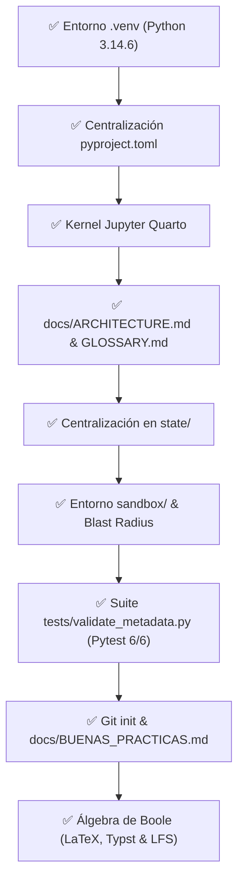

# Registro de Progreso (state/PROGRESS.md)

---

## 1. Estado de Subtareas

---

## 2. Bitácora Cronológica

- **2026-09-01 21:37:39:** Creación de `.venv` con Python 3.14.6 y verificación de herramientas (`typst`, `quarto`, `pdflatex`).
- **2026-09-01 21:40:43:** Instalación y prueba de importación de librerías (`numpy`, `scipy`, `sympy`, `schemdraw`, `pylatex`, `reportlab`, `plotly`).
- **2026-09-01 21:41:28:** Creación de [`pyproject.toml`](file:///G:/REPOSITORIOS%20GITHUB/RECURSOS/pyproject.toml) como única fuente de dependencias.
- **2026-09-01 21:55:41:** Sincronización de materias en [`docs/ARCHITECTURE.md`](file:///G:/REPOSITORIOS%20GITHUB/RECURSOS/docs/ARCHITECTURE.md) (`Circuitos`, `Electromagnetismo`, `Telecomunicaciones`, `VHDL`).
- **2026-09-01 22:05:48:** Centralización y optimización de los 4 archivos de memoria y estado en [`state/`](file:///G:/REPOSITORIOS%20GITHUB/RECURSOS/state).
- **2026-09-01 22:08:51:** Implementación de [`sandbox/`](file:///G:/REPOSITORIOS%20GITHUB/RECURSOS/sandbox) como entorno de experimentación y prototipado didáctico con `.gitignore`, [`README.md`](file:///G:/REPOSITORIOS%20GITHUB/RECURSOS/sandbox/README.md) y [`sandbox_guide.md`](file:///G:/REPOSITORIOS%20GITHUB/RECURSOS/sandbox/sandbox_guide.md).
- **2026-09-01 22:18:00:** Integración de [`GLOSSARY.md`](file:///G:/REPOSITORIOS%20GITHUB/RECURSOS/GLOSSARY.md) (`03_glossary`) y estandarización del modelo **Slug Secuencial Numérico (`XX_snake_case`)**.
- **2026-09-01 22:21:00:** Verificación de implementaciones, eliminación del archivo transitorio `plan_recursos_sistema.md` y reajuste canónico de la secuencia de IDs (`00_` a `09_`), estableciendo `sandbox/` como el espacio exclusivo para planes temporales.
- **2026-09-01 22:28:00:** Implementación del validador determinista de metadatos [`tests/validate_metadata.py`](file:///G:/REPOSITORIOS%20GITHUB/RECURSOS/tests/validate_metadata.py) y suite de pruebas unitarias [`tests/test_validate_metadata.py`](file:///G:/REPOSITORIOS%20GITHUB/RECURSOS/tests/test_validate_metadata.py) con exclusión estricta de `formato_minimo/`, tipado estricto `mypy` y cobertura de esquemas `Draft 2020-12`.
- **2026-09-01 22:34:00:** Auditoría y blindaje exhaustivo de [`.gitignore`](file:///G:/REPOSITORIOS%20GITHUB/RECURSOS/.gitignore) para cubrir todas las cachés de Python (`__pycache__`, `*.pyd`, `.hypothesis`, `.tox`), Jupyter (`.ipynb_checkpoints`), Quarto (`.quarto`, `*_files`, `*_cache`), Typst y compilación auxiliar LaTeX (`*.aux`, `*.fls`, `*.synctex.gz`, `*.toc`, etc.).
- **2026-09-01 22:45:00:** Inicialización del repositorio Git (`git init`), creación de la guía de buenas prácticas [`docs/BUENAS_PRACTICAS.md`](file:///G:/REPOSITORIOS%20GITHUB/RECURSOS/docs/BUENAS_PRACTICAS.md) (`04_buenas_practicas`) y sincronización secuencial de IDs (`00_` a `10_`).
- **2026-09-01 23:18:00:** Modernización y adaptación contextual de todos los esquemas JSON en [`schemas/`](file:///G:/REPOSITORIOS%20GITHUB/RECURSOS/schemas) (`frontmatter`, `manifest`, `memory_entry`, `rules`), añadiendo categoría `syllabus`, metadatos a los 4 temarios de `src/` (`11_` a `14_`) y validación integral con `jsonschema.Draft202012Validator`.
- **2026-09-01 23:30:00:** Incorporación en [`AGENTS.md`](file:///G:/REPOSITORIOS%20GITHUB/RECURSOS/AGENTS.md) (§7.2 y §9.8) de la regla obligatoria de actualización de estado en `state/` previa a cualquier push remoto, y consolidación atómica del commit inicial v1.0.0 en el repositorio GitHub.
- **2026-09-01 23:45:00:** Creación del compendio [`src/VHDL/algebra_boole.md`](file:///G:/REPOSITORIOS%20GITHUB/RECURSOS/src/VHDL/algebra_boole.md) con formulación matemática completa en $\LaTeX$ incrustado y validación canónica de metadatos (`15_algebra_boole`).
- **2026-09-01 23:55:00:** Configuración de [`.gitignore`](file:///G:/REPOSITORIOS%20GITHUB/RECURSOS/.gitignore) y [`.gitattributes`](file:///G:/REPOSITORIOS%20GITHUB/RECURSOS/.gitattributes) para seguimiento de imágenes generadas e integración de Git LFS para artefactos binarios (`.png`, `.pdf`) en `output/`.
- **2026-09-02 00:05:00:** Prototipado y estilización de lámina vectorial en Typst con paleta de colores didácticos (variables en azul, números en rojo, negaciones en púrpura, operadores en verde esmeralda) y ordenamiento horizontal izquierda a derecha.
- **2026-09-02 00:10:00:** Incorporación en [`src/VHDL/algebra_boole.md`](file:///G:/REPOSITORIOS%20GITHUB/RECURSOS/src/VHDL/algebra_boole.md) del Teorema de Expansión de Shannon (LUT/MUX), formalización del Principio de Dualidad e identidades complementarias XOR/XNOR para síntesis RTL.
- **2026-09-02 00:15:00:** Promoción del código Typst desde el sandbox al módulo canónico [`src/VHDL/algebra_boole.typ`](file:///G:/REPOSITORIOS%20GITHUB/RECURSOS/src/VHDL/algebra_boole.typ), emisión de artefactos en `output/` y sincronización con el repositorio remoto.
