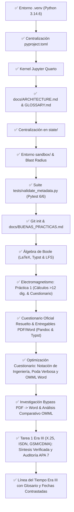

# Registro de Progreso (state/PROGRESS.md)

---

## 1. Estado de Subtareas

---

## 2. Bitácora Cronológica

- **2026-09-01 21:37:39:** Creación de `.venv` con Python 3.14.6 y verificación de herramientas (`typst`, `quarto`, `pdflatex`).
- **2026-09-01 21:40:43:** Instalación y prueba de importación de librerías (`numpy`, `scipy`, `sympy`, `schemdraw`, `pylatex`, `reportlab`, `plotly`).
- **2026-09-01 21:41:28:** Creación de [`pyproject.toml`](file:///G:/REPOSITORIOS%20GITHUB/RECURSOS/pyproject.toml) como única fuente de dependencias.
- **2026-09-01 21:55:41:** Sincronización de materias en [`docs/ARCHITECTURE.md`](file:///G:/REPOSITORIOS%20GITHUB/RECURSOS/docs/ARCHITECTURE.md) (`Circuitos`, `Electromagnetismo`, `Telecomunicaciones`, `VHDL`).
- **2026-09-01 22:05:48:** Centralización y optimización de los 4 archivos de memoria y estado en [`state/`](file:///G:/REPOSITORIOS%20GITHUB/RECURSOS/state).
- **2026-09-01 22:08:51:** Implementación de [`sandbox/`](file:///G:/REPOSITORIOS%20GITHUB/RECURSOS/sandbox) como entorno de experimentación y prototipado didáctico con `.gitignore`, [`README.md`](file:///G:/REPOSITORIOS%20GITHUB/RECURSOS/sandbox/README.md) y [`sandbox_guide.md`](file:///G:/REPOSITORIOS%20GITHUB/RECURSOS/sandbox/sandbox_guide.md).
- **2026-09-01 22:18:00:** Integración de [`GLOSSARY.md`](file:///G:/REPOSITORIOS%20GITHUB/RECURSOS/GLOSSARY.md) (`03_glossary`) y estandarización del modelo **Slug Secuencial Numérico (`XX_snake_case`)**.
- **2026-09-01 22:21:00:** Verificación de implementaciones, eliminación del archivo transitorio `plan_recursos_sistema.md` y reajuste canónico de la secuencia de IDs (`00_` a `09_`), estableciendo `sandbox/` como el espacio exclusivo para planes temporales.
- **2026-09-01 22:28:00:** Implementación del validador determinista de metadatos [`tests/validate_metadata.py`](file:///G:/REPOSITORIOS%20GITHUB/RECURSOS/tests/validate_metadata.py) y suite de pruebas unitarias [`tests/test_validate_metadata.py`](file:///G:/REPOSITORIOS%20GITHUB/RECURSOS/tests/test_validate_metadata.py) con exclusión estricta de `formato_minimo/`, tipado estricto `mypy` y cobertura de esquemas `Draft 2020-12`.
- **2026-09-01 22:34:00:** Auditoría y blindaje exhaustivo de [`.gitignore`](file:///G:/REPOSITORIOS%20GITHUB/RECURSOS/.gitignore) para cubrir todas las cachés de Python (`__pycache__`, `*.pyd`, `.hypothesis`, `.tox`), Jupyter (`.ipynb_checkpoints`), Quarto (`.quarto`, `*_files`, `*_cache`), Typst y compilación auxiliar LaTeX (`*.aux`, `*.fls`, `*.synctex.gz`, `*.toc`, etc.).
- **2026-09-01 22:45:00:** Inicialización del repositorio Git (`git init`), creación de la guía de buenas prácticas [`docs/BUENAS_PRACTICAS.md`](file:///G:/REPOSITORIOS%20GITHUB/RECURSOS/docs/BUENAS_PRACTICAS.md) (`04_buenas_practicas`) y sincronización secuencial de IDs (`00_` a `10_`).
- **2026-09-01 23:18:00:** Modernización y adaptación contextual de todos los esquemas JSON en [`schemas/`](file:///G:/REPOSITORIOS%20GITHUB/RECURSOS/schemas) (`frontmatter`, `manifest`, `memory_entry`, `rules`), añadiendo categoría `syllabus`, metadatos a los 4 temarios de `src/` (`11_` a `14_`) y validación integral con `jsonschema.Draft202012Validator`.
- **2026-09-01 23:30:00:** Incorporación en [`AGENTS.md`](file:///G:/REPOSITORIOS%20GITHUB/RECURSOS/AGENTS.md) (§7.2 y §9.8) de la regla obligatoria de actualización de estado en `state/` previa a cualquier push remoto, y consolidación atómica del commit inicial v1.0.0 en el repositorio GitHub.
- **2026-09-01 23:45:00:** Creación del compendio [`src/VHDL/algebra_boole.md`](file:///G:/REPOSITORIOS%20GITHUB/RECURSOS/src/VHDL/algebra_boole.md) con formulación matemática completa en $\LaTeX$ incrustado y validación canónica de metadatos (`15_algebra_boole`).
- **2026-09-01 23:55:00:** Configuración de [`.gitignore`](file:///G:/REPOSITORIOS%20GITHUB/RECURSOS/.gitignore) y [`.gitattributes`](file:///G:/REPOSITORIOS%20GITHUB/RECURSOS/.gitattributes) para seguimiento de imágenes generadas e integración de Git LFS para artefactos binarios (`.png`, `.pdf`) en `output/`.
- **2026-09-02 00:05:00:** Prototipado y estilización de lámina vectorial en Typst con paleta de colores didácticos (variables en azul, números en rojo, negaciones en púrpura, operadores en verde esmeralda) y ordenamiento horizontal izquierda a derecha.
- **2026-09-02 00:10:00:** Incorporación en [`src/VHDL/algebra_boole.md`](file:///G:/REPOSITORIOS%20GITHUB/RECURSOS/src/VHDL/algebra_boole.md) del Teorema de Expansión de Shannon (LUT/MUX), formalización del Principio de Dualidad e identidades complementarias XOR/XNOR para síntesis RTL.
- **2026-09-02 00:15:00:** Promoción del código Typst desde el sandbox al módulo canónico [`src/VHDL/algebra_boole.typ`](file:///G:/REPOSITORIOS%20GITHUB/RECURSOS/src/VHDL/algebra_boole.typ), emisión de artefactos en `output/` y sincronización con el repositorio remoto.
- **2026-09-03 22:15:00:** Elevación de precisión en [`src/Electromagnetismo/PRACTICA_1_RESUMEN.md`](file:///G:/REPOSITORIOS%20GITHUB/RECURSOS/src/Electromagnetismo/PRACTICA_1_RESUMEN.md) a más de 12 cifras significativas exactas (constantes $c$, $\mu_0$, $\varepsilon_0$, $\eta_0$, longitud de onda $\lambda$, monopolo $\lambda/4$, pérdidas FSPL continuas y tabla experimental). Extracción y creación del banco exhaustivo [`src/Electromagnetismo/PRACTICA_1_CUESTIONARIO.md`](file:///G:/REPOSITORIOS%20GITHUB/RECURSOS/src/Electromagnetismo/PRACTICA_1_CUESTIONARIO.md) (`18_practica_1_cuestionario`) con 30 preguntas avanzadas (Fresnel, dos rayos, Maxwell, condiciones de frontera, efecto pelicular, carta de Smith, ruido térmico Johnson-Nyquist y Shannon), incorporación de metadatos canónicos en [`PRACTICA_1_ORIGINAL.md`](file:///G:/REPOSITORIOS%20GITHUB/RECURSOS/src/Electromagnetismo/PRACTICA_1_ORIGINAL.md) y superación del 100% de la suite de pruebas Pytest (6/6).
- **2026-09-03 22:52:00:** Resolución analítica de las 10 preguntas oficiales en [`src/Electromagnetismo/PRACTICA_1_CUESTIONARIO_OFICIAL.md`](file:///G:/REPOSITORIOS%20GITHUB/RECURSOS/src/Electromagnetismo/PRACTICA_1_CUESTIONARIO_OFICIAL.md) (`19_practica_1_cuestionario_oficial`) con fundamentación en las Ecuaciones de Maxwell, deducción de la ecuación de Helmholtz, propagación atmosférica, modulación ASK/OOK y receptores superregenerativos. Generación exitosa de los formatos de distribución en [`output/PRACTICA_1_CUESTIONARIO_OFICIAL.docx`](file:///G:/REPOSITORIOS%20GITHUB/RECURSOS/output/PRACTICA_1_CUESTIONARIO_OFICIAL.docx) (Word nativo OMML vía Pandoc) y [`output/PRACTICA_1_CUESTIONARIO_OFICIAL.pdf`](file:///G:/REPOSITORIOS%20GITHUB/RECURSOS/output/PRACTICA_1_CUESTIONARIO_OFICIAL.pdf) (vía Pandoc y Typst engine). Validación del 100% de la suite Pytest.
- **2026-09-03 23:06:00:** Optimización y síntesis de respuestas en [`src/Electromagnetismo/PRACTICA_1_CUESTIONARIO_OFICIAL.md`](file:///G:/REPOSITORIOS%20GITHUB/RECURSOS/src/Electromagnetismo/PRACTICA_1_CUESTIONARIO_OFICIAL.md): reducción de redundancias y extensión verbosa para cuestionario preliminar, redondeo a notación de ingeniería (2-3 cifras significativas con prefijos SI), supresión total de diagramas Mermaid para compatibilidad tipográfica, y reestructuración de fórmulas matemáticas a bloques Display aislados `$$...$$` sin macros de acento combinatorio. Recompilación determinista con Pandoc generando [`output/PRACTICA_1_CUESTIONARIO_OFICIAL.docx`](file:///G:/REPOSITORIOS%20GITHUB/RECURSOS/output/PRACTICA_1_CUESTIONARIO_OFICIAL.docx) con ecuaciones Display OMML y fracciones apiladas verticales (`<m:type m:val="bar"/>`), [`output/PRACTICA_1_CUESTIONARIO_OFICIAL.pdf`](file:///G:/REPOSITORIOS%20GITHUB/RECURSOS/output/PRACTICA_1_CUESTIONARIO_OFICIAL.pdf) (vía Typst) y renderizado universal [`output/PRACTICA_1_CUESTIONARIO_OFICIAL.html`](file:///G:/REPOSITORIOS%20GITHUB/RECURSOS/output/PRACTICA_1_CUESTIONARIO_OFICIAL.html) (con MathJax). Verificación satisfactoria de pruebas unitarias Pytest (6/6).
- **2026-09-03 23:16:00:** Investigación, instalación y validación experimental de alternativas autónomas a Pandoc para Markdown a Word (`.docx`) con renderizado de fórmulas $\LaTeX$. Instalación exitosa de [`markdocx`](https://pypi.org/project/markdocx/) v10.0.2 e integración en `pyproject.toml`. Conversión determinista en 0.18s de [`src/Electromagnetismo/PRACTICA_1_CUESTIONARIO_OFICIAL.md`](file:///G:/REPOSITORIOS%20GITHUB/RECURSOS/src/Electromagnetismo/PRACTICA_1_CUESTIONARIO_OFICIAL.md) hacia [`output/PRACTICA_1_CUESTIONARIO_OFICIAL_markdocx.docx`](file:///G:/REPOSITORIOS%20GITHUB/RECURSOS/output/PRACTICA_1_CUESTIONARIO_OFICIAL_markdocx.docx), validando el enlace automático con la hoja de estilos oficial de Microsoft `MML2OMML.XSL` (`12` ecuaciones Display `<m:oMathPara>` y `17` fracciones apiladas verticales `<m:type m:val="bar"/>`). Generación comparativa con Quarto CLI (`quarto render --to docx`) y documentación completa de instalación en Windows 11 (incluyendo `winget install writage.writage` y `@mohtasham/md-to-docx`). Superación del 100% de la suite Pytest (6/6).
- **2026-09-04 22:20:00:** Investigación, implementación y ejecución exhaustiva del banco de pruebas de renderizado LaTeX a Word DOCX con soporte OMML nativo en [`sandbox/omml_latex_docx/`](file:///G:/REPOSITORIOS%20GITHUB/RECURSOS/sandbox/omml_latex_docx). Se desarrollaron y validaron 6 métodos técnicos: (1) Pipeline Python autónomo (`latex2mathml` + `MML2OMML.XSL` + `python-docx`) con 100% de éxito en ecuaciones Display/Inline nativas y cero dependencias de Office; (2) Quarto CLI (`quarto render --to docx`) con soporte OMML completo; (3) Ecosistema Node.js (`docx` npm + `temml` / MathML) con objetos matemáticos nativos; (4) Automatización COM Word / PowerShell con `OMaths.Add` y `BuildUp()`; (5) Typst $\rightarrow$ Pandoc $\rightarrow$ DOCX (`pandoc -f typst -t docx`); y (6) Demostración de degradación del importador directo HTML de Word (`Documents.Open`). Documentación completa en [`sandbox/omml_latex_docx/README.md`](file:///G:/REPOSITORIOS%20GITHUB/RECURSOS/sandbox/omml_latex_docx/README.md) y runner maestro [`sandbox/omml_latex_docx/run_all_experiments.py`](file:///G:/REPOSITORIOS%20GITHUB/RECURSOS/sandbox/omml_latex_docx/run_all_experiments.py).
- **2026-09-16 19:20:00:** Creación de [`src/Telecomunicaciones/TAREA_1_ERA_TECNOLOGICA.md`](file:///G:/REPOSITORIOS%20GITHUB/RECURSOS/src/Telecomunicaciones/TAREA_1_ERA_TECNOLOGICA.md) (`20_tarea_1_era_tecnologica`) con la síntesis verificada de la Era III (X.25, ISDN/RDSI y telefonía celular 1G/2G GSM e IS-95) depurada desde [`src/Telecomunicaciones/ERA_3_NOTEBOOK.md`](file:///G:/REPOSITORIOS%20GITHUB/RECURSOS/src/Telecomunicaciones/ERA_3_NOTEBOOK.md): se conservó únicamente la información atribuida a las tres fuentes bibliográficas, se descartaron los bloques declarados como no disponibles (inventariados como brechas en el Anexo A), se organizó el contenido en las cinco fases de indagación con matriz comparativa y diagramas Mermaid, y se auditó el formato APA 7 de las referencias (poda de edición redundante, supresión de "Editorial", separador punto y coma para edición y traductor, y orden alfabético). Validación de metadatos frontmatter conforme al esquema `Draft 2020-12`; la suite Pytest conserva 2 fallos preexistentes por falta de frontmatter en `ERA_3_NOTEBOOK.md` y `ERAS_TECNOLOGICAS.md` (ajenos a esta tarea).
- **2026-09-16 20:10:00:** Creación de [`src/Telecomunicaciones/LINEA_DEL_TIEMPO.md`](file:///G:/REPOSITORIOS%20GITHUB/RECURSOS/src/Telecomunicaciones/LINEA_DEL_TIEMPO.md) (`21_linea_del_tiempo`) con la línea del tiempo de la Era III derivada de [`src/Telecomunicaciones/TAREA_1_ERA_TECNOLOGICA.md`](file:///G:/REPOSITORIOS%20GITHUB/RECURSOS/src/Telecomunicaciones/TAREA_1_ERA_TECNOLOGICA.md): 25 hitos fechados en tres bloques (antecedentes y conmutación de paquetes, 1G analógica y digitalización RDSI/GSM/IS-95), glosario de 37 siglas y tabla de correcciones. El contraste externo de fechas corrigió cinco datos de la libreta: creación del grupo GSM en la CEPT (1982) frente a su transferencia a la ETSI (1989), despliegue comercial de GSM en 1991, estandarización de la RDSI en 1988, apertura del servicio NMT en 1981 y separación entre aprobación de IS-95 (1993) y su despliegue comercial (1995); además se corrigió la expansión del acrónimo AMPS. Validación de metadatos frontmatter conforme al esquema `Draft 2020-12`.

