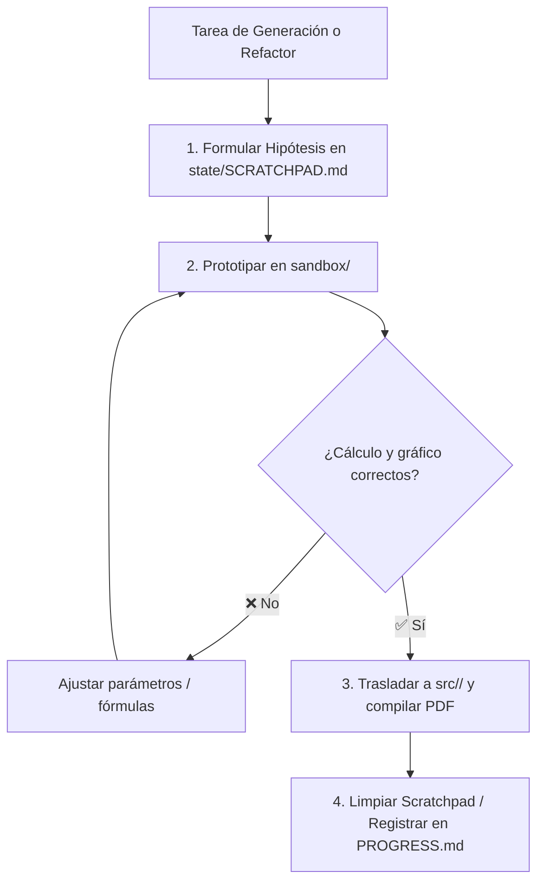

# Memoria de Trabajo y Borrador de Ejecución (state/SCRATCHPAD.md)

Este documento constituye la **memoria de trabajo temporal (*Working Memory*)** del agente. Funciona como un espacio de borrador estructurado para formular hipótesis, descomponer problemas pedagógicos y evaluar alternativas antes de escribir código permanente.

---

## 1. Ciclo de Razonamiento y Mutación

---

## 2. Sesión Activa / Tarea en Curso

- **Objetivo Actual:** Investigar y experimentar rigurosamente métodos para convertir Markdown con LaTeX incrustado a PDF (como bypass) y luego a Word (.docx), evaluando la integridad sintáctica y la presencia de ecuaciones nativas OMML (`<m:oMath>`).
- **Materia Involucrada:** `Investigación Ecosistema Documental / Sandbox`
- **Ficheros Afectados:** `sandbox/`, `state/SCRATCHPAD.md`, `state/PROGRESS.md`, `state/MEMORY.md`

---

## 3. Hipótesis Técnicas y Decisiones de Modelado

### Hipótesis 1 (Word PDF Reflow Automático):
- **Enfoque:** Compilar Markdown con LaTeX a PDF vía motores estándar (Typst, Pandoc/pdflatex, Quarto/Typst), y convertir el PDF resultante a DOCX mediante la API COM de Microsoft Word (`WINWORD.EXE` Reflow Engine).
- **Validación con Sandbox:** `sandbox/test_pdf_to_word_com.py` y `sandbox/inspect_omml.py`.
- **Pregunta Crítica:** ¿Reconoce el motor Reflow de Word las expresiones matemáticas de un PDF y las transforma en elementos OMML (`<m:oMath>`), o las convierte en texto plano / imágenes / símbolos sueltos?

### Hipótesis 2 (Python `pdf2docx` y librerías OCR/Layout):
- **Enfoque:** Evaluar si convertidores de PDF a Word en Python (`pdf2docx`) son capaces de reconstruir fórmulas matemáticas en OMML.
- **Validación con Sandbox:** Prueba en sandbox con `pdf2docx`.

### Hipótesis 3 (Herramientas Especializadas de Reconstrucción Matemática PDF -> Word):
- **Enfoque:** Evaluar soluciones especializadas en OCR matemático (Mathpix PDF conversion, InftyReader) frente a convertidores estándar de PDF (Acrobat, Word Reflow).

### Hipótesis 4 (Vías Alternativas de Bypass Estructurado):
- **Enfoque:** Si el PDF como formato pierde el árbol sintáctico (AST) al convertirse en glifos posicionales, evaluar bypasses intermedios que sí preserven el AST matemático completo: Markdown -> LaTeX (`.tex`) -> Word, o Markdown -> HTML con MathML -> Word.

---

## 4. Checklist de Validación Rápida (DoD)

- [ ] Crear documento de prueba Markdown representativo con LaTeX en `sandbox/`
- [ ] Compilar Markdown a PDF usando motores disponibles (Typst, LaTeX)
- [ ] Ejecutar conversión PDF a Word vía COM de MS Word 16
- [ ] Inspeccionar el XML interno del DOCX generado (`word/document.xml`) buscando `<m:oMath>`
- [ ] Documentar hallazgos, limitaciones fundamentales del bypass PDF y recomendaciones viables
- [ ] Actualizar `state/SCRATCHPAD.md`, `state/PROGRESS.md` y `state/MEMORY.md`
- [ ] Validar suite de pruebas con `pytest`

