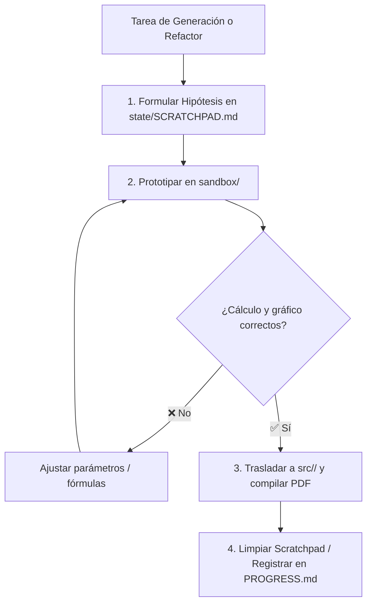

# Memoria de Trabajo y Borrador de Ejecución (state/SCRATCHPAD.md)

Este documento constituye la **memoria de trabajo temporal (*Working Memory*)** del agente. Funciona como un espacio de borrador estructurado para formular hipótesis, descomponer problemas pedagógicos y evaluar alternativas antes de escribir código permanente.

---

## 1. Ciclo de Razonamiento y Mutación

---

## 2. Sesión Activa / Tarea en Curso

- **Objetivo Actual:** `[Definir objetivo de la sesión o recurso a construir]`
- **Materia Involucrada:** `Circuitos` | `Electromagnetismo` | `Telecomunicaciones` | `VHDL`
- **Ficheros Afectados:** `src/<Materia>/`, `templates/`, `tests/`

---

## 3. Hipótesis Técnicas y Decisiones de Modelado

### Hipótesis A:
- **Enfoque:** `[Descripción del modelado matemático o circuito]`
- **Validación con Sandbox:** `sandbox/proto_<materia>.py`
- **Resultado Esperado:** `[Fórmulas analíticas LaTeX, gráfico SVG o PDF generado]`

---

## 4. Checklist de Validación Rápida (DoD)

- [ ] Código numérico y simbólico probado en `.venv`
- [ ] Esquema vectorial exportado a SVG/PDF sin pérdidas
- [ ] Plantilla Typst/Quarto compilada sin advertencias
- [ ] Tipos estáticos verificados con `mypy --strict`
- [ ] Actualización de estado en `PROGRESS.md`
